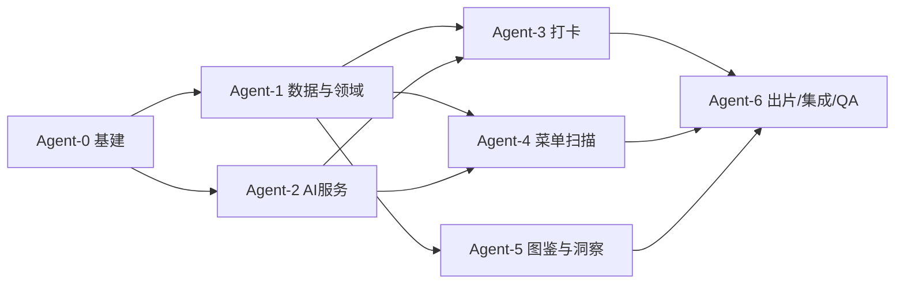

# AI Agent 并行开发分工说明

> 配套文档：`docs/PRD-地球Online美食图鉴.md`、`docs/技术设计文档-地球Online美食图鉴.md`、`docs/开发任务清单-地球Online美食图鉴.md`。本文件只讲**分工与协作规则**，需求/设计细节以那三份为准（任务 ID 与任务清单一致）。

## 1. 总览：6 个 Agent，3 个批次



| Agent | 代号 | 投入时机 | 对应任务 |
| --- | --- | --- | --- |
| Agent-0 | foundation | 批次 1（必须最先完成） | T0-01~07 |
| Agent-1 | data | 批次 2，与 Agent-2 并行 | T1-01~06、T5-05、T5-06 |
| Agent-2 | ai | 批次 2，与 Agent-1 并行 | T0-06、T2-01/02、T2-05、T3-02、T4-04、T4-05 |
| Agent-3 | capture | 批次 3 | T1-07/08/09、T2-03/04/06/07/08/09、T5-04 部分 |
| Agent-4 | scan | 批次 3 | T3-01~08、T4-03 中打卡前提示 |
| Agent-5 | dex | 批次 3 | T1-10/11、T3-07、T4-01/02/03/06、T1-09 部分 |
| Agent-6 | card | 批次 3（引擎可提前到批次2末开工） | T5-01~04、T5-07/08/09 |

- 批次 3 共 4 个 agent 并行；Agent-6 的 Canvas 引擎只依赖类型定义，可在 Agent-0 完成后即开工。
- 每个 agent 一个人即可；人力不足时，Agent-1/2 可由同一人串行。

## 2. 协作规则（所有 Agent 必须遵守）

1. **分支**：不使用 feature 分支，所有 agent 直接在 `zxc` 分支上提交改动；提交前先 `git pull --rebase` 同步远端，禁止 force push，禁止改写他人已推送的提交历史。
2. **目录所有权（强约束，防冲突）**：只允许在自己名下目录写代码；需要改共享文件时走 §3 登记机制。

| Agent | 独占目录 |
| --- | --- |
| Agent-0 | 工程根配置、`src/app/`、`src/ui/`、`src/styles/`、`.github/` |
| Agent-1 | `src/domain/`、`src/infra/db/`、`src/infra/blob/`、`src/infra/backup/` |
| Agent-2 | `src/infra/ai/`、`src/infra/queue/`、BFF 目录 `bff/`、`src/workers/` 中 AI 相关 |
| Agent-3 | `src/pages/capture/`、`src/pages/home/`、`src/features/capture/`、`src/features/tags/`、`src/features/rating/`、`src/workers/image.worker.ts` |
| Agent-4 | `src/pages/scan/`、`src/features/scan-menu/` |
| Agent-5 | `src/pages/dex/`、`src/pages/restaurant/`、`src/pages/dish/`、`src/pages/insights/`、`src/features/dex-grid/`、`src/features/insights/`、`src/workers/stats.worker.ts` |
| Agent-6 | `src/pages/card/`（如需要）、`src/features/share-card/`、`src/infra/card/`、`tests/e2e/` |

3. **接口冻结点**：Agent-0 产出、Agent-1/2 在开工第 1 天必须冻结以下文件，之后只允许追加、不允许改签名（改动须在提交说明中 @ 所有受影响 agent）：
   - `src/domain/entities/*.ts`（实体类型）
   - `src/infra/db/repositories.ts`（Repository 接口签名）
   - `src/infra/ai/types.ts`（AIProvider 接口与 DTO）
   - `src/ui/index.ts`（DS 组件导出清单）
4. **共享文件只由 Owner 改**：路由表（Agent-0 维护，各 agent 提交路由片段给 Agent-0 合并）、导航栏（Agent-0）、全局样式与主题变量（Agent-0）。
5. **自测**：领域纯函数必须带 Vitest 单测；页面功能自测通过再提交；E2E 由 Agent-6 统一编写。
6. **提交**：commit 带任务 ID（如 `feat(T2-03): ...`）；不提无关重构；不格式化别人目录的文件。
7. **Mock 优先**：批次 3 的 agent 一律通过 Agent-2 的 Mock adapter 开发，不等真实模型。

## 3. 跨 Agent 交付物接口

| 交付物 | 产出者 | 消费者 | 形态 |
| --- | --- | --- | --- |
| 实体类型 + Repository 接口 | Agent-0 初版 → Agent-1 实现 | 3/4/5/6 | TS 接口 + 内存假实现（Agent-0 提供，供批次3先行开发） |
| AIProvider 接口 + Mock adapter | Agent-0 初版 → Agent-2 实现 | 3/4 | 固定夹具 JSON，失败模式可注入 |
| DS 组件库 | Agent-0 | 3/4/5/6 | `src/ui/index.ts` 具名导出 |
| 图片压缩/BlobStore | Agent-1（BlobStore）/ Agent-3（image worker） | 3/4/6 | `BlobStore.put/get/delete/usage`；`compressImage(file): CompressedImage` |
| 解锁/避雷/统计纯服务 | Agent-1 | 3/4/5 | 纯函数，入参出参见 TDD §3.3/§3.5 |
| AsyncQueue | Agent-2 | Agent-3（标签回填） | `enqueue(job): void` + 状态查询 hook |
| 卡片渲染器 | Agent-6 | Agent-3（打卡成功后入口） | `renderCard(data, template): Promise<Blob>` |
| 路由片段 | 3/4/5/6 | Agent-0 合并 | 各自导出 `{ path, element, lazy() }` |

## 4. 各 Agent 任务卡

### Agent-0 · foundation（基建官）

**先读**：TDD §2.3/§2.4/§9。
**做什么**：
1. Vite+React18+TS(strict)+Tailwind+Router(v6 lazy)+Zustand+TanStack Query+Dexie 工程，按 TDD §2.4 建全部空目录；
2. lint/prettier/husky/lint-staged；GitHub Actions（lint→typecheck→test→build→playwright），push 到 zxc 触发；
3. Vitest/Testing Library/Playwright 双视口脚手架；
4. `src/ui/` DS：Button/Input/Textarea/Sheet/Dialog/Chip/Empty/Toast/Stars（半星）/Switch/LoadingButton，主题变量含图鉴配色与暗色；
5. App 壳：底部导航 4 Tab、路由占位、ErrorBoundary、Web Font 方案；
6. **冻结契约**：写 `domain/entities` 类型（TDD §11 全文）、Repository 与 AIProvider 接口签名、各接口的**内存假实现**（`infra/db/__inmemory__`、`infra/ai/adapters/mock.ts` 含 recognize/menu-scan/tags 夹具与失败注入开关）。
**验收**：空壳可跑；CI 全绿；批次 3 agent 用 mock 能调通"假打卡"全链路。
**不要碰**：各 feature 目录、BFF 真实实现。

### Agent-1 · data（数据与领域）

**先读**：TDD §3.3/§3.4/§4、PRD §7。**任务**：T1-01~06、T5-05、T5-06。
**做什么**：
1. Dexie schema v1（TDD §4.1）+ 迁移机制 + IDB 不可用降级；
2. Repository 实现与打卡原子事务（Restaurant/Dish/Log/Photo 同事务）；
3. BlobStore（IDB Blob 适配器，estimate/persist）；
4. 领域纯服务（**全部带单测，行覆盖 ≥85%**）：`normalizeDishName`、`similarity/matchDish`（阈值 0.8/0.95，TDD §3.4）、`unlock.derive`、`avoid.evaluate`、评分聚合；
5. 标签受控词表与近义归一映射（与 Agent-2 共同评审）；
6. JSON 导入导出（图片分卷、导入冲突复用 matchDish、schemaVersion 校验）、设置页存储管理与 recomputeAll。
**验收**：事务回滚、避雷聚合、删光 Log 回 locked、相似度阈值矩阵等单测全绿。
**不要碰**：页面组件、AI 网络层。

### Agent-2 · ai（AI 服务）

**先读**：TDD §5、PRD §6。**任务**：T2-01/02、T2-05（队列部分）、T3-02、T4-04、T4-05。
**做什么**：
1. BFF 边缘函数（Key 注入/体限制/限流/错误归一化/no-store）+ `VITE_AI_MODE` 开关；
2. AIProviderRouter：AbortController 超时（recognize 15s / ocr 20s / tags 10s）、有限重试、AIError 码、zod 校验；
3. Prompt 版本化：recognize.v1、menu-scan.v1、tags.v1（下发词表、强 JSON）、card-copy.v1；真实供应商联调，产出 30 张菜品图 + 20 份菜单的 bad-case 夹具；
4. AsyncQueue（持久化到 jobs 表，指数退避 2/5/15s × 3，可续跑）；
5. 历史标签批量补全任务（进度/续跑）。
**验收**：recognize P95≤6s、高置信采纳率≥60%；菜单结构化可用率≥70%；断网/超时/脏 JSON 全部归一为可降级错误。
**不要碰**：页面；领域实体（需要字段提 issue 给 Agent-1）。

### Agent-3 · capture（打卡流程）

**先读**：PRD §5.1、用户流程图 A、EC-CAP/EC-TAG 全表。**任务**：T1-07/08/09、T2-03/04/06/07/08/09。
**做什么**：
1. `/capture` 流程页：拍照（getUserMedia、权限/非 HTTPS 降级）、多图上传 ≤9、image.worker 压缩管线 + blur 预检；
2. 识别确认页：置信度三档（≥0.8/0.5–0.8/<0.5）UI、Top3 候选、多菜品勾选/合并/手添/改名（EC-CAP-10~14）；
3. 附加信息表单（星级半星与避雷开关联动、店铺联想新建、草稿 24h）；
4. createLogWorkflow 编排：调 Agent-2 接口 → 15s 超时降级手动 → 调 Agent-1 事务保存 → 解锁/追加态与动效 → 标签经 AsyncQueue 异步回填；
5. 标签确认 UI（Chips、<0.6 进"AI 还猜了"、自定义标签）；
6. 首页时间线与快捷入口；本地埋点上报。
**验收**：Mock 成功/失败两种模式下，高置信 3 步内保存；EC-CAP-01~14、EC-TAG-01~03 逐条自测通过。
**不要碰**：`src/domain`、`src/infra`（只用接口）、扫描/图鉴页面。

### Agent-4 · scan（菜单扫描）

**先读**：PRD §5.3.1、流程图 B、EC-MENU 全表。**任务**：T3-01~08、T4-03 打卡前 fuzzy 提示。
**做什么**：
1. `/scan/:rid?` 状态机：upload→preview→ocr→confirm→saving→done，全程草稿；
2. 多图上传（≤10/10MB）、清晰/反光预检、旋转 90°（P1）；
3. OCR 确认页：分区折叠、行内改菜名/价/分区/删除、不可读区块 bbox 高亮+框选重扫+手添、低置信行强制处理；
4. 调 Agent-1 的 `matchDish` 完成 exact 自动关联/fuzzy 合并弹窗/new 建灰菜；严格执行 `nameSource=user` 保护、无 userDecision 不入库；
5. 增量扫描 diff（added/removed/renamed）与扫描历史；
6. 打卡选店时若与本店避雷菜相似度 ≥0.8，保存前弹提示（与 Agent-3 协作挂接点，由 Agent-4 提供 hook）。
**验收**：EC-MENU-01~07 全过；两轮扫描同店只确认差异。
**不要碰**：匹配算法本身（只调用，有问题提给 Agent-1）、图鉴网格样式（用 Agent-5 组件）。

### Agent-5 · dex（图鉴/店铺/洞察/避雷视图）

**先读**：PRD §5.3.2、§5.4、EC-DEX/EC-INS 全表。**任务**：T1-10/11、T3-07、T4-01/02/03/06。
**做什么**：
1. 图鉴网格（三态：彩色/灰剪影问号/红角标）、三视图（店铺/菜系/标签）、筛选排序（query string）、虚拟滚动（千条 60fps）；
2. 店铺详情：头图、进度条+五档等级文案、分区网格、避雷横幅与置顶高亮、空态 CTA；
3. 菜品详情：图片画廊、评分/避雷开关、标签、Log 时间线、删除后经领域服务重算；
4. stats.worker：严格按 PRD §5.4.1 口径（近 365 天、维度内归一、cuisine.primary 单选、分母 0→null、streak），statCache + SWR；
5. 洞察页：总览卡、环形图、标签云（语义色/下钻）、趋势图（P1）、避雷库与撤销、全局搜索（避雷角标）。
**验收**：统计口径单测 + 小数据空态；避雷三处联动中"横幅/搜索角标"由本 agent 完成。
**不要碰**：统计口径之外的写入逻辑；出片功能（只放跳转按钮）。

### Agent-6 · card / integration / qa（出片 + 集成验收）

**先读**：PRD §8、§10，TDD §3.7、§8。**任务**：T5-01~04、T5-07/08/09。
**做什么**：
1. JSON 节点树驱动的 Canvas 引擎（@2x 离屏、条件显隐重排、文本省略、fonts.ready 后导出、污染探测）；
2. 三模板（经典图鉴/霓虹夜市/米其林留白）+ 避雷黄黑皮肤；1080×1440 PNG，保存（a.download/FSA）与 Web Share 降级；
3. 出片入口挂到 Agent-3 打卡成功页与 Agent-5 菜品详情页（只加跳转/回调，不改对方业务逻辑）；
4. 收口 NFR：分包/lazy、响应式 360–1440、无障碍、CSP、PWA App Shell；
5. 编写全部 E2E（PRD §10.1 七条 → 用例 E2E-CAP-HAPPY / AI-FALLBACK / MENU-STATES / AVOID-LINKS / INSIGHTS / CARD-EXPORT / BACKUP-RESTORE）+ 三模板视觉回归；组织真机抽验；
6. 生产部署、BFF 密钥、冒烟与回滚预案。
**验收**：七条准入 E2E 全绿；三模板 × 有图/无图/避雷截图回归通过；Lighthouse 移动 ≥85。

## 5. 集成顺序（提交到 zxc 的门禁）

1. Agent-0 基建已直接提交在 `zxc`；Agent-1、Agent-2 基于最新 `zxc` 并行开发；
2. Agent-1（含内存假实现替换为真实 DB）、Agent-2（Mock + BFF）提交后，批次 3 开工；
3. 批次 3 四个 agent 直接向 `zxc` 提交，建议顺序：Agent-5（纯视图）→ Agent-3（主链路）→ Agent-4 → Agent-6；每轮合入由 Agent-6 跑一次全量 E2E 回归；
4. 冲突仲裁：目录归属冲突以 §2 表为准；契约签名冲突由 Agent-0 + Agent-1 裁定；需求歧义查 PRD，仍不明暂停并问产品，不得自行扩需求。

## 6. 给每个 Agent 的统一启动提示词（复制即用）

```text
你是 FoodDex 项目的 {代号} 开发 agent。仓库根目录 docs/ 下有四份文档：
PRD、技术设计文档、开发任务清单、AI-Agent并行开发分工。请先全部阅读，
然后严格按分工文档中 Agent-{n} 的任务卡执行：
- 只在分配给你的目录写代码，遵守目录所有权与接口冻结规则；
- 直接在 `zxc` 分支提交，commit 带任务 ID，提交前先 `git pull --rebase`；
- 依赖其他 agent 的交付物时，只调用 §3 表中的接口，接口缺失或不符则暂停并反馈，不要自行改别人的文件；
- 完成任务卡的全部验收标准后，将改动直接提交到 zxc 分支，并在提交说明中列出已完成任务 ID 与自测结果。
```
