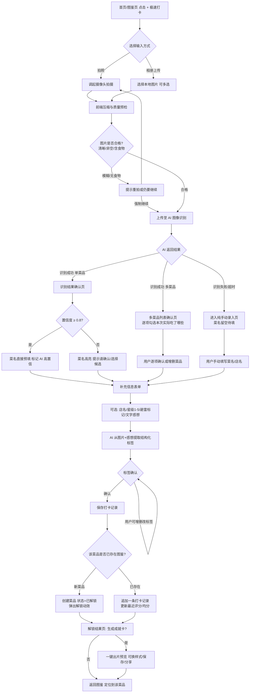
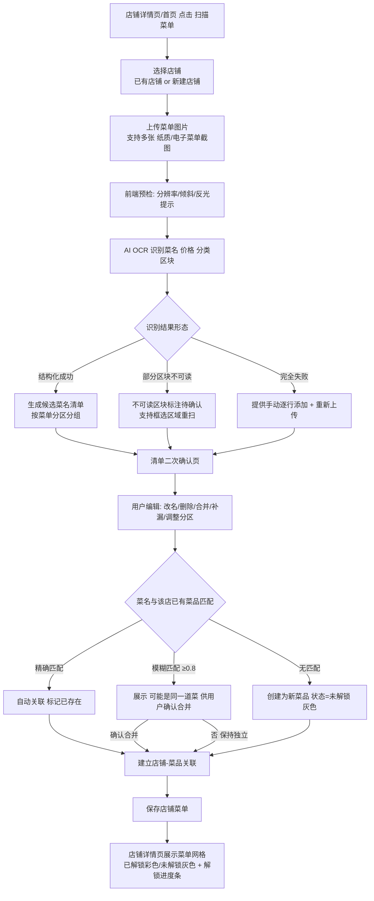
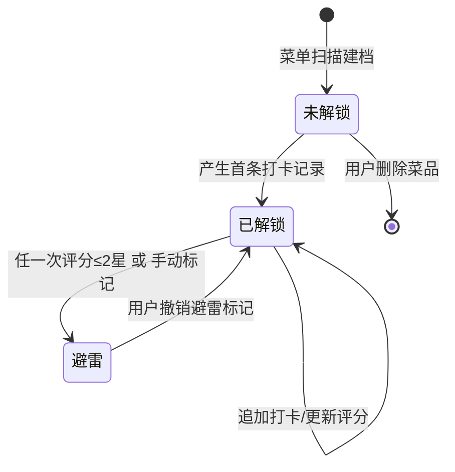
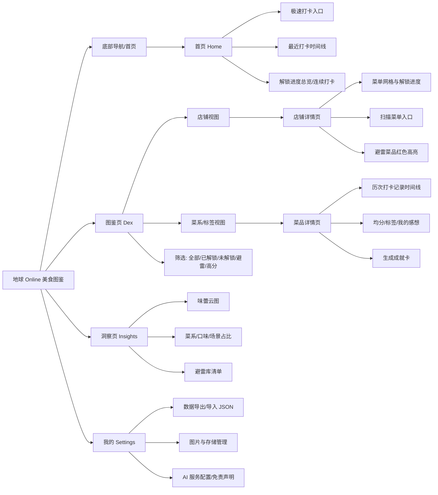
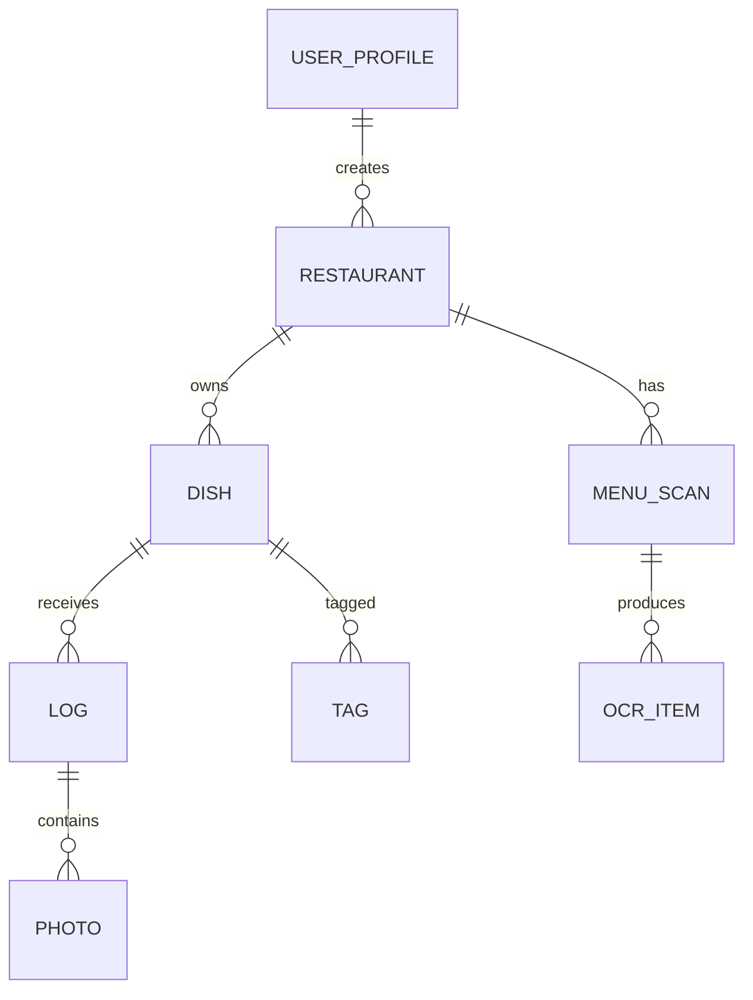

# 地球 Online 美食图鉴 · 产品需求文档（PRD）

## 1. 文档信息（Document Info）

| 项目 | 内容 |
| --- | --- |
| 产品名称 | 地球 Online 美食图鉴（Earth Online Food Dex，内部代号：FoodDex） |
| 文档版本 | v1.0.0 |
| 文档状态 | 评审稿（Ready for Dev Review） |
| 编写日期 | 2026-09-12 |
| 文档作者 | 产品部 |
| 文档目标 | 面向前端、后端、AI 算法、设计与测试团队，明确首个可交付版本（MVP，v1.0）的产品范围、交互逻辑、AI 行为规范、数据结构与视觉要求，作为开发排期、技术方案设计与验收测试的统一依据 |
| 适用读者 | 前端工程师、全栈工程师、AI/多模态算法工程师、UI/UX 设计师、QA 测试工程师 |
| 关联文档 | 《UI 视觉设计稿》《AI 模型接口约定》（待补充链接） |

### 1.1 版本修订记录

| 版本 | 日期 | 修订人 | 修订说明 |
| --- | --- | --- | --- |
| v0.1 | 2026-09-05 | 产品部 | 产品概念与核心功能脑暴 |
| v0.9 | 2026-09-10 | 产品部 | 补充 AI 交互规范与数据结构草案 |
| v1.0.0 | 2026-09-12 | 产品部 | 首版正式 PRD，含完整用户流程、边界情况、海报设计指南 |

### 1.2 术语表（Glossary）

| 术语 | 定义 |
| --- | --- |
| 打卡 / Log | 用户对一次真实用餐行为的记录，包含菜品、店铺、评分、图片等 |
| 图鉴 / Dex | 已解锁菜品的集合视图，概念借鉴宝可梦图鉴（Pokédex） |
| 解锁 / Unlock | 菜品首次产生打卡记录后，其状态由「未解锁」变为「已解锁」 |
| 避雷 / Avoid | 用户对菜品给出 1–2 星（或主动标记避雷）后，该菜品进入避雷库并被高亮提醒 |
| 菜单扫描 / Menu Scan | 用户上传店铺菜单图片，经 AI OCR 生成该店的菜品清单 |
| 成就卡 / 海报 / Share Card | 一键出片功能生成的、可保存分享的游戏图鉴风格图片 |
| 置信度 / Confidence | AI 对识别结果的确信程度，取值 0–1，用于决定是否要求用户二次确认 |
| 味蕾云图 | 用户口味/菜系/场景等标签的聚合可视化视图 |

---

## 2. 产品概述

### 2.1 产品背景

美食记录类产品存在三类普遍痛点：

1. **记录成本高**：传统工具需要手动输入菜名、店名、标签，用户难以坚持；
2. **记忆不可靠**：吃过的菜好不好吃、在哪家店踩过雷，随时间遗忘，导致重复点同一道难吃的菜；
3. **缺乏成就感**：流水账式的记录没有收集乐趣与长期激励。

多模态大模型的图像理解与 OCR 能力，已足以把「拍照 → 结构化美食档案」的链路压缩到 10 秒以内，使「游戏化美食图鉴」这一形态在轻量 Web 端成为可能。

### 2.2 产品定位

一款**游戏化（地球 Online 风格）的个人美食收集与打卡网页应用**：用户像收集宝可梦、点亮游戏图鉴一样记录吃过的美食与店铺菜单；通过 AI 自动识别与智能排版，把记录成本降到最低；通过评分体系与多维统计，实现「不重复踩雷」与「了解自己的味蕾」。

一句话定位：**「你的人生菜单，吃一道，解锁一道。」**

### 2.3 核心价值

| 价值主张 | 对应能力 |
| --- | --- |
| 游戏化打卡 | 图鉴收集、未解锁/已解锁状态、店铺菜单解锁进度、成就卡海报 |
| 避雷与复盘 | 1–5 星评分 + 避雷标记、低分菜品高亮提醒、味蕾云图与偏好分析 |
| 智能与极速 | 拍照 AI 识别菜名/标签、菜单 OCR 批量建档、一键生成分享海报 |

### 2.4 目标用户与典型场景

- **核心用户**：18–35 岁、有外食/探店习惯、乐于在社交平台分享美食的年轻用户；
- **次级用户**：希望记录个人饮食档案的美食爱好者、留学生与差旅人群。

| 场景 | 用户故事 |
| --- | --- |
| 餐厅快速记录 | 菜上桌后拍一张照，10 秒内完成菜名确认、星级评分并生成成就卡发朋友圈 |
| 探店前做功课 | 打开某家店图鉴，灰色是没吃过的，红色高亮是上次打 1 星的菜，避免复踩 |
| 整店菜单收集 | 拍下餐厅菜单，一次性把全店菜品扫成图鉴清单，此后随吃随解锁 |
| 年度/阶段复盘 | 查看味蕾云图：自己 45% 的饭局是辣味、30% 是川菜，复盘饮食偏好 |

### 2.5 产品范围与技术约束

**形态与部署**

- 纯 Web 端应用（SPA，单页应用），支持桌面与移动端浏览器，移动端优先做响应式适配；
- 不依赖任何第三方点餐/外卖/点评类 APP 或 API；所有数据来源于用户上传与 AI 识别整理；
- AI 能力通过**可配置的多模态大模型服务**（图像理解 + OCR）实现，模型供应商对产品层透明、可替换；
- v1.0 数据以**浏览器本地存储（IndexedDB）为主**，图片做本地压缩持久化；数据模型预留云端同步字段（`syncState`、`updatedAt`），不阻塞后续多端方案。

**v1.0 范围内（In Scope）**

- AI 拍照打卡（单菜品/多菜品识别）、评分与标签提取；
- 菜单图片 OCR 扫描、菜品与店铺建档、解锁状态管理；
- 图鉴多维度视图（按店铺/菜系标签/避雷高分筛选）；
- 味蕾云图与偏好统计、店铺内避雷提醒；
- 一键生成游戏图鉴风成就卡（前端 Canvas 渲染 + 导出 PNG）；
- 本地数据导入/导出（JSON 备份）。

**v1.0 范围外（Out of Scope，后续版本）**

- 账号体系与社交关系链、好友图鉴、点赞评论；
- 云端多端同步、LBS 地图与附近餐厅；
- 多人拼单/AA、餐厅经营数据；
- PWA 离线推送（仅保证弱网下已加载页面可用）。

---

## 3. 用户流程与逻辑流（User Flow）

### 3.1 主场景 A：拍照打卡（AI Capture）



**流程关键规则**

- 全流程支持「中断与草稿」：在确认页之前退出，本地保留草稿 24 小时；
- 从拍照到可保存，**目标操作步数 ≤ 3 步**（拍 → 确认 → 保存），所有附加信息均可跳过；
- AI 处理期间展示可取消的进度态，超过 15 秒未返回自动降级为手动录入。

### 3.2 主场景 B：上传菜单（Menu Scan）



**流程关键规则**

- 一次菜单扫描最多支持 10 张图片、单张不超过 10MB；
- OCR 仅提取**菜名、价格、菜单分区（如「招牌菜」「主食」）**，不试图识别图片本身是否好吃；
- 扫描结果必须经过用户确认才入库，**AI 永不直接静默写库**；
- 同一店铺允许重复扫描：进入「增量比对」流程，只让用户处理新增与冲突项。

### 3.3 全局状态流：菜品生命周期



---

## 4. 信息架构（IA）与页面地图



---

## 5. 详细功能需求（Detailed Functional Requirements）

> 需求标注约定：**[P0]** 为 v1.0 必做；**[P1]** 为 v1.0 尽量交付、可顺延；每条需求可被 QA 直接转化为测试用例。

### 5.1 模块一：AI 极速打卡与录入系统

#### 5.1.1 入口与拍摄/上传页

**页面元素**

- 顶部：页面标题「极速打卡」、关闭按钮；
- 主体：拍照/上传区，支持「拍照」与「相册选择」两个 Tab；
- 移动端：「拍照」调起 `getUserMedia` 摄像头实时预览 + 快门按钮；相册使用 `<input type="file" accept="image/*" multiple capture>`；
- 桌面端：默认展示拖拽上传区，支持点击选择与 Ctrl/Cmd 多选；
- 底部：已选图片缩略图横排（可删除、可追加），主按钮「开始识别（N）」。

**交互逻辑**

1. 选图后立即在前端压缩：长边 ≥ 1600px 的图等比缩至 1600px，统一输出 JPEG 质量 0.82，单图控制在约 500KB 以内；
2. 压缩后做**本地预检**（可选，[P1] 用轻量分类模型或边缘检测）：模糊（拉普拉斯方差低于阈值）、画面无人脸食物特征时弹出提示「这张图可能没拍清/没有食物，要重拍吗？」，但提供「仍要识别」；
3. 点击「开始识别」进入识别中状态。

**边界情况（Edge Cases）**

| 编号 | 场景 | 处理规则 |
| --- | --- | --- |
| EC-CAP-01 | 用户拒绝摄像头权限 | 展示授权引导示意图 + 「改用相册上传」按钮，不卡死流程 |
| EC-CAP-02 | 非 HTTPS 环境无法调摄像头 | 自动隐藏拍照 Tab，仅保留相册上传 |
| EC-CAP-03 | 选择了非图片文件 / HEIC 等不兼容格式 | 上传前校验 MIME；HEIC 提示转为 JPG 或引导系统相册导出 |
| EC-CAP-04 | 单次选择超过 9 张图 | 提示「单次最多识别 9 张」，禁止继续追加 |
| EC-CAP-05 | 图片超过 10MB 且压缩失败 | 提示图片过大，要求重新选择 |
| EC-CAP-06 | 识别过程中网络中断 | 保留图片与草稿，按钮变为「重试识别 / 手动录入」 |
| EC-CAP-07 | 浏览器存储配额不足 | 保存前检测配额，提示清理旧图片或导出备份 |

#### 5.1.2 识别结果确认页（核心二次确认）

**页面元素**

- 顶部图片预览区（可左右切换多张图）；
- 菜品卡片区：每张图识别到的菜品，逐卡展示「AI 建议菜名 + 置信度视觉态 + 候选下拉」；
- 多图/多菜品时展示菜品列表，每行带勾选框（本次是否吃了这道）、行内「改名 / 删除」；
- 底部按钮：「+ 手动添加一道」「确认，补充分（主）」。

**交互逻辑**

1. **单菜品高置信（confidence ≥ 0.8）**：菜名直接预填，名称后展示淡色「AI 识别」小标，不强制打断；
2. **低置信（0.5 ≤ confidence < 0.8）**：菜名输入框黄色描边 + 文案「请帮 AI 确认一下菜名」，下拉给出 Top 3 候选（如「毛血旺 / 水煮肉片 / 麻辣烫」）；
3. **极低置信（< 0.5）或识别为泛类（只识别出「炒菜/火锅/肉」）**：输入框红色描边并聚焦，要求必须确认/填写后才能进入下一步；
4. **多菜品识别**：默认全部勾选；用户可取消勾选（图里有但本次没吃）、可合并（AI 把同一盘菜识别成两条）；
5. 确认后的菜名以**用户输入为最终值**，同时保留 `aiSuggestedName` 原值用于后续优化与去重。

**边界情况**

| 编号 | 场景 | 处理规则 |
| --- | --- | --- |
| EC-CAP-10 | 一张图识别出 0 道菜品 | 直接进入手动录入，图片仍作为打卡配图保留 |
| EC-CAP-11 | 一张图识别出 > 8 个菜品 | 折叠展示「共识别到 N 道」，默认仅前 8 道勾选，其余折叠待展开 |
| EC-CAP-12 | AI 返回重复/高度相似菜名 | 相似度 ≥ 0.9 时自动合并为一条并提示「已为你合并重复项，可撤销」 |
| EC-CAP-13 | 识别到的菜品与用户已有图鉴同名 | 菜名行展示「图鉴中已有 · 第 2 次打卡」标签，保存时走追加逻辑 |
| EC-CAP-14 | 用户全部取消勾选 | 主按钮降级为「仅保存图片（不打卡菜品）」或禁用并引导手动添加 |

#### 5.1.3 附加信息表单

**页面元素与字段**

| 字段 | 控件 | 必填 | 规则 |
| --- | --- | --- | --- |
| 店铺名称 | 搜索联想输入框（数据源为本地店铺库）+ 「新建店铺」 | 否 | 选中已有店铺则关联；新建只需店名，城市/商圈可选 |
| 评分 | 5 星可点按组件，支持半星（步长 0.5） | 否 | 不评分时显示「这次先不打分」 |
| 避雷标记 | 独立开关「这道菜是雷，提醒我别再点」 | 否 | 当评分 ≤ 2 星时自动开启，用户可关闭 |
| 价格 | 数字输入（元，可选） | 否 | 用于后续人均统计 |
| 文字感想 | 多行文本，最多 500 字，实时字数 | 否 | 为空也可保存；作为 AI 标签提取的输入之一 |
| 用餐时间 | 默认当前时间，可改 | 否 | 用于时间线统计 |
| 用餐场景 | 标签快选：一人食/约会/聚餐/商务/外卖 | 否 | 不选时由 AI 尝试推断并待确认 |

**交互逻辑**

- 评分与避雷联动：选 1–2 星时避雷开关自动滑开并轻震动（移动端 `navigator.vibrate`，[P1]）；
- 店铺输入框输入时实时模糊搜索本地店铺（匹配店名/别名），无结果时回车即新建；
- 表单填写完成点击保存后，触发 AI 标签提取（见 5.1.4），标签确认浮层与保存并行：**记录先落库为「标签处理中」，标签返回后补全**，避免用户等待。

#### 5.1.4 AI 智能标签提取

**标签体系（受控词表 + 自由扩展）**

| 维度 | 示例标签 | 来源 |
| --- | --- | --- |
| 口味 taste | 麻辣、香辣、甜辣、酸甜、咸鲜、清淡、蒜香、酸爽、苦、奶香味 | AI 提取，命中受控词表则归一化 |
| 菜系 cuisine | 川菜、粤菜、湘菜、鲁菜、日料、韩餐、西餐、东南亚、快餐、火锅、烧烤、甜品 | AI 分类，单选主菜系 + 多选副标签 |
| 食材 ingredient | 牛肉、鸡肉、海鲜、豆腐、菌菇、内脏 | AI 提取 |
| 烹饪方式 cooking | 炒、炖、烤、炸、蒸、凉拌、水煮 | AI 提取 |
| 场景 scene | 一人食、聚餐、约会、商务、外卖、夜宵、早餐 | AI 推断或用户选择 |
| 自定义 custom | 用户可手动创建任意标签 | 用户 |

**交互逻辑**

1. AI 基于「菜品图片 + 用户确认菜名 + 文字感想」输出标签 JSON：`{taste:[], cuisine:{primary, secondary[]}, ingredient:[], cooking:[], scene:[]}`，每个标签附带置信度；
2. 标签以可删除的 Chip 形式展示，末尾固定「+ 标签」按钮（从受控词表选择或自由输入）；
3. 置信度 < 0.6 的标签默认**不选中**、放入「AI 还猜了：xx」区域，点击才采纳；
4. 标签提取失败不阻断打卡：记录正常保存，标签区显示「点击手动添加标签」。

**边界情况**

| 编号 | 场景 | 处理规则 |
| --- | --- | --- |
| EC-TAG-01 | AI 返回词表外的口语标签（如「下饭」） | 保留为自定义标签，并在后台累计高频词，供词表迭代 |
| EC-TAG-02 | 同一标签出现近义重复（「辣」「很辣」「麻辣」） | 按归一化映射表收敛，仅保留粒度最合适的一个 |
| EC-TAG-03 | 标签服务超时 | 打卡先成功；标签区允许稍后「重试 AI 提取」或手动补 |

### 5.2 模块二：一键智能出片（成就卡/海报生成）

#### 5.2.1 功能说明

用户保存打卡后（或在任何菜品详情页），可一键生成一张「游戏成就 / 图鉴卡」风格海报，导出 PNG 至本地或调起系统分享。海报由前端 **Canvas/SVG 模板引擎** 渲染，保证无网络也能出片。

**页面元素**

- 海报预览区（手机端按 3:4 画幅缩放展示）；
- 模板横滑选择器：v1.0 提供至少 3 套模板（见第 8 章）；
- 可编辑字段开关：是否显示店名、评分、日期、AI 短评、个人水印；
- 主按钮：「保存到相册」（下载 PNG，1080×1440，2x 图）、「分享」（Web Share API，不支持时退化为长按保存提示）；
- [P1] 「换一句 AI 成就文案」按钮：基于菜名/评分/标签生成 3 条游戏化文案轮播，如「🔥 新图鉴解锁！麻辣 +1，你的辣味图鉴已达 45%」。

**边界情况**

| 编号 | 场景 | 处理规则 |
| --- | --- | --- |
| EC-CARD-01 | 打卡无图片 | 使用图鉴默认插画底（按菜系着色的矢量占位图），不阻塞出片 |
| EC-CARD-02 | 未评分/无店名/无标签 | 对应模块整块隐藏，版式自动重排，不留空字段 |
| EC-CARD-03 | 店名/感想过长 | 店名单行省略；感想最多 2 行 40 字，超出省略 |
| EC-CARD-04 | Canvas 跨域图片污染导致无法导出 | 图片一律经后端/本地对象 URL 同源加载，导出前校验 `ctx.getImageData` 不抛异常 |
| EC-CARD-05 | 用户设备字体缺失 | 内嵌或使用 Web Font（标题字 + 正文字），渲染前 `document.fonts.ready` 后再导出 |

### 5.3 模块三：图鉴与解锁系统

#### 5.3.1 菜单扫描与店铺建档

**页面元素**

- 入口：首页「扫描菜单」、店铺详情页「更新菜单」；
- 店铺选择页：搜索/新建店铺（字段：店名、城市[可选]、商圈[可选]、别名[可选]）；
- 上传页：多图上传，逐张显示「清晰/疑似反光」预检提示；
- OCR 确认页：
  - 左侧/上方为菜单原图，可框选区块裁剪重扫；
  - 右侧/下方为按分区折叠的候选菜品清单，每行：菜名（可改）、价格（可改/可删）、分区（可拖动调整）、删除；
  - 底部：「+ 手动加一道」「忽略不可读区域」「保存菜单（N 道菜）」。

**OCR 匹配与去重逻辑（核心规则）**

1. AI 输出结构化结果：`{sections: [{name:"招牌菜", items:[{name, price, confidence, bbox}]}]}`；
2. 菜名归一化：去除尾部规格词（「/例」「/份」「（大）」）、去除装饰符号、全角转半角；
3. 与**本店已有菜品**比对：
   - 归一化后完全相同 → 自动关联为同一道，不重复创建；
   - 编辑相似度（Levenshtein/Jaccard）≥ 0.8，或包含关系且长度差 ≤ 2 字 → 标记「可能重复」，弹窗让用户二选一：合并 / 保持独立；
   - 跨店同名菜（如「宫保鸡丁」）**不自动合并**：菜品归属于店铺，跨店同名是不同的 DinerDish 实体（见第 7 章），但共享同一「标准菜品名」抽象用于标签统计；
4. 置信度 < 0.6 的 OCR 行：行首黄色感叹号，必须展开确认或删除后才能保存；
5. 价格识别失败不阻塞：价格留空可保存。

**边界情况**

| 编号 | 场景 | 处理规则 |
| --- | --- | --- |
| EC-MENU-01 | 菜单为多页长图/拼接图 | 支持最多 10 张；按上传顺序分图展示，允许整图删除重传 |
| EC-MENU-02 | 图片倾斜严重 | 前端提示并提供拍照引导框；[P1] 支持手动旋转 90° 与透视裁剪 |
| EC-MENU-03 | 菜单含英文/拼音/图文混杂 | AI 以中文菜名为主，外文原名存为 `aliases[]` |
| EC-MENU-04 | OCR 把套餐/酒水识别为菜 | 分区与品名规则识别「酒水/茶位/餐具费」，默认归入「其他」折叠区，不计入菜品解锁统计 |
| EC-MENU-05 | 重复扫描同一店铺 | 进入增量模式：diff 出新增/消失/改名候选，仅确认差异；旧菜默认保留不删除 |
| EC-MENU-06 | 用户手动改过的菜名被再次扫描覆盖 | 已人工确认（`nameSource=user`）的菜名永不被 AI 结果覆盖，仅提示「AI 这次识别为 XX」 |
| EC-MENU-07 | 一菜多价（例牌/大份） | 菜品一个实体，价格用规格数组保存 `[{spec:"例", price:38}]` |

#### 5.3.2 图鉴多维度视图

**5.3.2.1 全局图鉴页**

- 顶部统计条：已解锁 X / 总菜品 Y、避雷 Z、本周新增 N；
- 视图切换 Tab：**按店铺 | 按菜系 | 按标签**；
- 筛选器 Chips：全部 / 仅未解锁 / 仅避雷 / 高分（≥4）/ 有图 / 近期打卡；
- 排序：最近打卡、解锁时间、评分均分、名称；
- 菜品网格：每格为一张「图鉴格子」——
  - 已解锁：菜品图、菜名、均分星级、所属店名；
  - 未解锁：灰色剪影 + 问号占位 + 菜名（菜名对用户可见，属"知道但没吃过"）；
  - 避雷：右上角红色警示角标。

**5.3.2.2 店铺详情页**

- 店铺头图（自动取该店最高均分菜品图）、店名、城市/商圈、我的均分、打卡次数；
- **解锁进度条**：`已解锁菜品数 / 菜单总菜品数`，百分比 + 游戏化等级文案（0–20% 初来乍到 / 20–50% 熟客 / 50–80% 老饕 / 80–99% 扫地僧 / 100% 全图鉴制霸）；
- 菜单网格按 OCR 分区分组；未解锁灰色、已解锁彩色、避雷红色描边置顶；
- **避雷提醒条**：当店铺存在避雷菜品时，顶部固定黄色横幅「本店有 N 道你的避雷菜，查看」，点击定位并闪烁高亮；
- 操作：扫描/更新菜单、新增打卡、编辑店铺。

**5.3.2.3 菜系/标签视图**

- 按菜系聚合为卡片：菜系封面图（取该菜系下最高分菜品图）、菜系名、已解锁数；
- 标签视图下标签以**字号加权**方式预演云图（详见 5.4）。

**5.3.2.4 菜品详情页**

- 菜品主图（可切换历次打卡图片画廊）、菜名、所属店铺、标准菜系标签；
- 评分区：我的均分、最近一次评分、评分次数、避雷状态开关；
- AI 与用户标签 Chips；
- 历次打卡时间线（日期、星级、感想、缩略图）；
- 操作：追加打卡、编辑/删除记录、生成成就卡。

**边界情况**

| 编号 | 场景 | 处理规则 |
| --- | --- | --- |
| EC-DEX-01 | 店铺菜单尚未扫描 | 网格空态展示插画 + 「扫描第一份菜单」CTA |
| EC-DEX-02 | 菜品仅手动打卡、店铺无菜单 | 自动以该菜品创建仅含 1 道菜的菜单，进度 100% |
| EC-DEX-03 | 删除一条打卡后该菜品无任何记录 | 菜品回退为「未解锁」灰态（仍在菜单中），不删除实体；并提示 |
| EC-DEX-04 | 删除整家店铺 | 二次确认：店铺下的打卡/图片将一并删除（或可选「仅删菜单保留打卡」） |
| EC-DEX-05 | 避雷菜品在全局视图 | 仅在用户主动筛选或进入店铺时高亮，不在首页时间线做负面打扰 |

### 5.4 模块四：数据可视化与避雷提醒

#### 5.4.1 洞察页（Insights）

**页面结构**

1. **总览卡片**：累计打卡数、已解锁菜品、店铺数、连续打卡天数；
2. **味蕾云图**：
   - 形态：标签云 + 环形占比图双视图可切换；
   - 标签字号/透明度按出现频次加权；口味标签用语义色（辣-红、酸甜-橙、清淡-绿、奶香-米白）；
   - 默认展示 Top 20，点击任一标签下钻菜品列表；
3. **菜系占比**：环形图展示打卡次数口径的菜系占比（如「辣味 45%、川菜 30%」的呈现：口味占比与菜系占比为两张独立图，避免口径混淆）；
4. **趋势区 [P1]**：近 6 个月口味堆叠折线图、平均星级走势；
5. **避雷库**：所有避雷菜品清单（店铺分组、我的低分与短评、撤销避雷入口）；
6. **AI 味蕾总结 [P1]**：调用大模型基于近 90 天统计生成 3 段式俏皮总结（味蕾人设 + 偏好 + 一条建议），用户可一键换文案或用于成就卡。

**统计口径（必须在 UI  tooltip 中明示）**

| 指标 | 口径 |
| --- | --- |
| 口味/菜系占比 | 近 365 天**打卡条数**中该标签出现次数 / 全部标签命中次数；一条多标签的菜在各标签下各计一次（各维度内部独立归一，故同维度合计 100%） |
| 解锁数 | 当前状态为已解锁的去重菜品数（按"店铺 × 菜品"实体） |
| 店铺均分 | 该店全部打卡评分的算术平均，保留 1 位小数 |
| 连续打卡 | 按自然日有 ≥1 条打卡计 1 天，跨天连续计数 |

**避雷提醒触发规则**

| 触发点 | 规则 |
| --- | --- |
| 店铺详情页 | 顶部横幅 + 网格红色置顶（见 5.3.2.2） |
| 打卡时选择该店铺并新增同名/相似菜 | 若新菜与本店避雷菜相似度 ≥ 0.8，保存前弹轻提示「你在 2026-08-01 给过『XX』1 星，确定是同一道吗？」 |
| 全局搜索店铺/菜品 | 命中避雷项时结果行带红色角标，不折叠不隐藏 |
| 仅手动标记避雷、从无评分的菜 | 同等参与提醒；撤销后立即解除全部提醒 |

**边界情况**

| 编号 | 场景 | 处理规则 |
| --- | --- | --- |
| EC-INS-01 | 打卡数 < 5 条 | 图表区显示空态引导（「再打卡 N 次解锁你的味蕾云图」），用假数据骨架但明确标注"预览样式" |
| EC-INS-02 | 所有记录均无标签 | 提供「一键让 AI 补全历史标签」批处理，逐图异步执行并展示进度 |
| EC-INS-03 | 用户撤销避雷 | 全部视图与提醒即时刷新；历史低分记录仍保留在时间线 |
| EC-INS-04 | 统计分母为 0 | 占比显示「—」而非 0%，避免误导 |

### 5.5 模块五：我的与数据管理

- 本地数据**导出**：下载单个 JSON 备份（含全部结构化数据；图片可选「随包导出 Base64 / 仅导出数据」）；
- **导入**：选择 JSON 恢复/合并，导入走与 OCR 相同的冲突确认（同店同菜询问合并）；
- 存储管理：展示图片占用空间，支持「仅保留近一年图片」「清空全部图片（保留文字）」；
- AI 配置：展示当前 AI 服务状态、模型标识与「AI 可能识别错误，请以你确认为准」免责声明；提供「清除 AI 缓存结果」；
- 关于：版本号、用户数据完全保存在本地浏览器的隐私说明。

---

## 6. AI 交互规范（AI Interaction Specification）

本章为跨模块的统一 AI 行为契约，算法与前端共同遵守。

### 6.1 通用原则

1. **AI 只建议，人来确认**：任何 AI 产出（菜名、标签、菜单项）必须经用户确认才持久化；用户修改永远优先，且 `nameSource / tagSource` 标记为 `user` 的字段不再被 AI 静默覆盖；
2. **可解释的置信度**：所有识别结果必须带 `confidence ∈ [0,1]`；UI 三档视觉态：高（≥0.8 绿色/默认）、中（0.5–0.8 黄色）、低（<0.5 红色，必须处理）；
3. **可降级**：识别失败、超时（阈值 15s）、服务不可用时，全部退化为等价的纯手动流程，已上传图片与表单草稿不丢失；
4. **可重试与可纠错**：每个 AI 结果旁提供「重认一次」与手动编辑入口；纠错结果（用户最终值 vs AI 初值）回流为优化样本。

### 6.2 拍照识别规范

| 项目 | 规范 |
| --- | --- |
| 输入 | 压缩后图片（最长边 1600px，JPEG q0.82）+ 可选用户已填上下文（店名、已有图鉴菜名列表） |
| 输出（单图） | `{dishes:[{name, confidence, candidates:[...max3], bbox?}], imageQuality:{blur:bool, hasFood:bool}}` |
| 多菜品 | 一张图可返回多道菜，每道独立置信度与候选；前端默认全选、支持合并/取消 |
| 消歧 | 当用户上下文（本店菜单）中存在同名/近义菜，优先返回菜单内标准名并在候选中给出 |
| 失败定义 | HTTP 失败、超时、返回空、JSON 不合规、`hasFood=false` 且用户未强制继续 |
| 失败处理 | 图保留 → 手动录入页；提供「重试」；不得反复自动重试超过 1 次 |

### 6.3 菜单 OCR 规范

| 项目 | 规范 |
| --- | --- |
| 输入 | 菜单图片（最多 10 张）+ 店铺 ID（用于拉取本店已有菜品做匹配） |
| 输出 | `{sections:[{name, items:[{name, price, spec?, confidence, bbox}]}], unreadableRegions:[bbox]}` |
| 菜名归一化 | 去规格尾缀/标点/全半角差异；外文与括号内名存入 `aliases` |
| 匹配 | 与本店菜品：精确=自动关联；相似度 ≥0.8=人工确认合并；<0.8=新建未解锁。跨店只做统计层抽象，不合并实体 |
| 人工保护 | `nameSource=user` 的菜名在任何重扫中只读，AI 改名只能作为"建议"展示 |
| 不可读区域 | 以 bbox 高亮，支持框选重扫、手动补录、忽略；不允许在无任何确认的情况下丢弃整图结果 |
| 增量扫描 | 以本店现有菜单为基线做 diff，仅让用户确认 added / removed / renamed 候选 |

### 6.4 标签提取规范

- 输入：图片 + 确认菜名 + 评论文本；输出严格受限于第 5.1.4 的 JSON 结构；
- 标签必须来自受控词表或显式标记为 `custom`；近义词按归一化表收敛；
- confidence < 0.6 的标签默认不选中；提取失败不阻断主流程；
- 菜系主标签 `cuisine.primary` 全局单选口径，用于占比图，避免多标签导致百分比不可比。

### 6.5 性能与成本约束

| 指标 | 目标 |
| --- | --- |
| 单图识别 P95 响应 | ≤ 6 秒（含上传） |
| 菜单单图 OCR P95 | ≤ 10 秒 |
| 标签提取 | 异步，不阻塞保存；P95 ≤ 5 秒 |
| 前端出片渲染 | ≤ 1.5 秒（中端移动设备） |
| 失败兜底 | 15 秒超时 → 手动流程 |

---

## 7. 数据结构设计建议（Data Schema Suggestion）

> 以下为 v1.0 本地持久化（IndexedDB，建议库名 `fooddex`）的逻辑模型。金额单位统一为「元」，时间统一为 ISO 8601 字符串，ID 使用 `crypto.randomUUID()`。所有表含 `createdAt / updatedAt / syncState` 公共字段（下文部分省略以聚焦业务字段）。

### 7.1 ER 关系概览



- 一个 **Restaurant（店铺）** 拥有多个 **Dish（店铺菜品）**；
- 一个 Dish 拥有多条 **Log（打卡记录）**，「已解锁」= 存在 ≥1 条 Log；
- **OCRItem** 是菜单扫描的原始候选，确认后提升为 Dish；
- 跨店同名菜通过 `canonicalDishId` 指向同一个 **CanonicalDish（标准菜品抽象）**，仅用于标签与菜系统计。

### 7.2 Restaurant（店铺）

```json
{
  "id": "rst_9f2c1a",
  "name": "川香小馆（大学城店）",
  "aliases": ["川香", "Chuanxiang Bistro"],
  "city": "广州",
  "district": "大学城北亭",
  "address": "",
  "coverPhotoId": "pho_001",
  "dishIds": ["dsh_101", "dsh_102"],
  "stats": {
    "dishTotal": 42,
    "unlockedCount": 17,
    "avoidCount": 2,
    "avgRating": 4.1,
    "logCount": 23
  },
  "createdAt": "2026-09-01T12:00:00+08:00",
  "updatedAt": "2026-09-12T19:30:00+08:00",
  "syncState": "local_only"
}
```

### 7.3 CanonicalDish（标准菜品，跨店统计抽象）

```json
{
  "id": "can_gongbaojiding",
  "name": "宫保鸡丁",
  "cuisinePrimary": "川菜",
  "defaultTags": { "taste": ["香辣", "甜辣"], "ingredient": ["鸡肉", "花生"] },
  "aliases": ["Kung Pao Chicken", "宫爆鸡丁"]
}
```

### 7.4 Dish（店铺菜品 = 图鉴条目）

```json
{
  "id": "dsh_101",
  "restaurantId": "rst_9f2c1a",
  "name": "水煮牛肉",
  "nameSource": "user",
  "aiSuggestedName": "水煮肉片",
  "canonicalDishId": "can_shuizhuniurou",
  "section": "招牌菜",
  "aliases": [],
  "prices": [{ "spec": "例", "price": 58 }, { "spec": "大份", "price": 88 }],
  "status": "unlocked",
  "isAvoid": false,
  "unlockedAt": "2026-09-05T19:02:11+08:00",
  "firstLogId": "log_0001",
  "stats": {
    "logCount": 3,
    "avgRating": 4.5,
    "latestRating": 5,
    "latestLogAt": "2026-09-10T20:11:00+08:00"
  },
  "tags": [
    { "dim": "taste", "value": "麻辣", "source": "ai", "confidence": 0.93 },
    { "dim": "cuisine", "value": "川菜", "source": "ai", "confidence": 0.97 },
    { "dim": "scene", "value": "聚餐", "source": "user" }
  ],
  "createdAt": "2026-09-01T12:05:00+08:00",
  "updatedAt": "2026-09-10T20:11:00+08:00"
}
```

字段约束：`status` 枚举 `locked | unlocked`；`nameSource` 枚举 `ai | user | ocr`；`tags[].dim` 枚举 `taste|cuisine|ingredient|cooking|scene|custom`；`tags[].source` 枚举 `ai|user`。

### 7.5 Log（打卡记录）

```json
{
  "id": "log_0003",
  "dishId": "dsh_101",
  "restaurantId": "rst_9f2c1a",
  "canonicalDishId": "can_shuizhuniurou",
  "rating": 5,
  "manualAvoid": false,
  "comment": "牛肉滑嫩，麻味够正，比上次更稳。",
  "price": 58,
  "scene": "聚餐",
  "ateAt": "2026-09-10T20:11:00+08:00",
  "photoIds": ["pho_010", "pho_011"],
  "aiSnapshot": {
    "recognizedName": "水煮牛肉",
    "confidence": 0.91,
    "candidates": ["水煮牛肉", "水煮鱼", "毛血旺"],
    "modelVendor": "vendor-x",
    "modelVersion": "vision-2026-08"
  },
  "tagExtractionState": "done",
  "createdAt": "2026-09-10T20:12:00+08:00",
  "updatedAt": "2026-09-10T20:12:00+08:00"
}
```

字段约束：`rating` 为 `null` 或 `0.5–5` 的 0.5 步长数值；避雷判定 = `rating <= 2 || manualAvoid === true`；`tagExtractionState` 枚举 `pending|done|failed`。

### 7.6 Photo（图片）

```json
{
  "id": "pho_010",
  "refType": "log",
  "refId": "log_0003",
  "blobKey": "idb://blobs/pho_010.jpg",
  "width": 1600,
  "height": 1200,
  "sizeBytes": 482130,
  "isCover": true,
  "createdAt": "2026-09-10T20:12:00+08:00"
}
```

### 7.7 MenuScan 与 OCRItem（扫描任务与候选）

```json
{
  "scan": {
    "id": "scan_008",
    "restaurantId": "rst_9f2c1a",
    "sourceImageIds": ["pho_020", "pho_021"],
    "status": "confirmed",
    "isIncremental": true,
    "diffSummary": { "added": 6, "removed": 1, "renamed": 2 },
    "createdAt": "2026-09-12T12:00:00+08:00",
    "confirmedAt": "2026-09-12T12:04:30+08:00"
  },
  "ocrItem": {
    "id": "ocr_301",
    "scanId": "scan_008",
    "sourceImageId": "pho_020",
    "section": "招牌菜",
    "rawText": "水煮牛肉/例 ￥58",
    "normalizedName": "水煮牛肉",
    "price": 58,
    "confidence": 0.88,
    "bbox": { "x": 120, "y": 340, "w": 600, "h": 64 },
    "matchResult": { "type": "exact", "dishId": "dsh_101" },
    "userDecision": "linked",
    "createdAt": "2026-09-12T12:00:02+08:00"
  }
}
```

字段约束：`matchResult.type` 枚举 `exact|fuzzy|new|ignored`，fuzzy 时必须携带候选数组；`userDecision` 枚举 `linked|merged|keptSeparate|ignored|deleted`，**无用户决策不允许转 Dish**。

### 7.8 UserProfile / 设置

```json
{
  "id": "me",
  "nickname": "地球玩家_0421",
  "watermark": "@地球玩家_0421",
  "preferences": {
    "defaultCardTemplate": "dex_rare",
    "imageQuality": "high",
    "aiAssistedNaming": true
  },
  "stats": { "totalLogs": 86, "unlockedDishes": 61, "restaurants": 14, "streakDays": 9 },
  "onboardedAt": "2026-08-01T09:00:00+08:00"
}
```

### 7.9 索引建议（IndexedDB / 未来云端通用）

- `dish`：`(restaurantId)`、`(status)`、`(canonicalDishId)`、`(isAvoid)`；
- `log`：`(dishId, ateAt)`、`(restaurantId, ateAt)`、`(ateAt)`；
- `ocrItem`：`(scanId)`、`(matchResult.type)`。

---

## 8. 一键出片 / 海报设计指南（Shareable Card Design Guide）

### 8.1 设计目标

让分享图在 0.5 秒内传达三件事：**这是什么菜（图）+ 好不好吃（星）+ 我解锁了什么成就（游戏感）**，整体风格为「游戏图鉴卡 × 高级餐厅菜单」。

- 画幅：**3:4 竖版**，导出 1080×1440（@2x 2160×2880 可选）；
- 安全区：四周内边距 ≥ 64px，核心文字避开底部 120px（平台 UI 遮挡区）；
- 字体：标题用具有游戏感的展示字（粗黑/衬线变体），正文用现代无衬线中文字体；必须使用可商用字体并随包 Web Font 化。

### 8.2 必含 UI 元素（信息层级）

| 层级 | 元素 | 说明 |
| --- | --- | --- |
| L1 视觉主体 | 美食大图 | 占卡片上方约 55–60%，统一圆角 + 内描边，做图鉴框质感 |
| L1 游戏符号 | 稀有度/属性角标 | 按评分映射：1–2 星「⚡雷品 WARNING」、3 星「COMMON」、4 星「RARE」、5 星「LEGENDARY 传说」；角标位于图左上 |
| L1 星级 | 大号星级组件 | 图叠层底部或标题旁，5 星点亮 + 数值（如 4.5） |
| L2 标题 | 菜品名 | 超大号字重，带编号样式「No.061」（即第 61 个解锁） |
| L2 副标题 | 店铺名 · 菜系 | 「川香小馆 · 川菜」，分隔点排版 |
| L2 标签 | 3–5 枚标签 Chips | 取置信度最高的口味/场景标签，AI 短评可选 |
| L3 成就文案 | 游戏化一句话 | 如「🔥 新图鉴解锁！你的麻辣图鉴 +1，辣味收集度 45%」 |
| L3 元信息 | 日期/地点/水印 | 小号字置于底部；个人水印可开关 |
| 背景 | 纹理与光效 | 深色噪点/羊皮纸/镭射渐变随模板变化；低饱和以衬托食物 |

### 8.3 版式示意（Template A · 经典图鉴）

```
┌──────────────────────────┐
│ [No.061]        [RARE ★] │
│                          │
│      ┌────────────┐      │
│      │            │      │
│      │  美食大图  │      │
│      │            │      │
│      └────────────┘      │
│            ★★★★☆ 4.5     │
│  水煮牛肉                │
│  川香小馆 · 川菜         │
│  [麻辣] [聚餐] [重口味]  │
│  ─────────────────────   │
│ 「麻辣 +1，辣味图鉴45%」 │
│  2026.09.10 广州  @水印  │
└──────────────────────────┘
```

### 8.4 v1.0 三套模板

| 模板 | 风格 | 配色 | 适用 |
| --- | --- | --- | --- |
| A · 经典图鉴 | 宝可梦卡片式描边框 + 编号 + 属性标 | 米白纸面 + 墨绿/烫金 | 默认，全评分通用 |
| B · 霓虹夜市 | 深色底 + 霓虹描边 + 赛博标签 | 深紫黑 + 霓虹红/青 | 烧烤、火锅、夜宵、辣菜 |
| C · 米其林留白 | 大留白衬线排版 + 细线分隔 | 象牙白 + 黑金 | 高分（≥4.5）正餐、约会场景 |

避雷专项：1–2 星菜品使用模板时切换为「雷品警报」皮肤——暗灰底 + 警示黄黑斜纹角标「⚡ 已标记避雷」，仍可出片（自嘲式分享），但默认关闭一键分享到外部的二次确认提示，避免误发负面内容。

### 8.5 组件与适配规则

- 无图：模板 A/C 用菜系色矢量插画占位（火锅=红汤锅图形、日料=蓝白波纹），版式不变；
- 字段缺失：整块隐藏并重新分配留白（不留「—」与空 chips）；
- 长文本：菜名最多 1 行 12 字、店名 1 行 14 字、短评 2 行，超出省略；
- 图片处理：统一 `object-fit: cover` 居中裁剪，导出前做轻量锐化与亮度归一；
- 深色/浅色底文字对比度满足 WCAG AA（≥4.5:1）；
- 输出：PNG，文件名 `fooddex_菜名_日期.png`；桌面端额外提供 JPEG 小尺寸版便于即时通讯软件发送。

---

## 9. 非功能性需求（NFR）

| 类别 | 要求 |
| --- | --- |
| 兼容性 | 最近 2 个大版本的 Chrome / Edge / Safari / iOS Safari / 安卓 Chrome；移动端断点 360–430px 重点适配，桌面 1280px+ |
| 性能 | 首屏可交互 ≤ 3s（4G）；图鉴列表千级数据虚拟滚动；图片懒加载 + 缩略图（建议生成 400px 缩略图） |
| 可用性 | 核心打卡链路在 AI 服务不可用时 100% 可手动完成；本地 CRUD 离线可用 |
| 隐私安全 | 图片与数据默认不出本地浏览器；AI 识别上传前在设置中明示；不收集通讯录/位置（地点均为手填）；导出文件不上传任何服务器 |
| 可访问性 | 触控目标 ≥ 44px；星级与避雷状态不仅靠颜色传达（配合图标/文字）；支持系统字体缩放至 125% |
| 可观测性 | 本地埋点事件队列（打卡开始/识别成功/识别降级/出片/避雷触发），供用户自愿导出帮助改进，默认不外发 |

---

## 10. 验收标准与成功指标

### 10.1 v1.0 发布准入（Acceptance Criteria）

1. 从拍照到保存一条打卡，全链路（高置信单菜品）可在 3 次点击内完成；
2. AI 失败/超时场景下，第 6 章定义的全部手动降级路径可用且草稿不丢；
3. 菜单扫描 → 二次确认 → 未解锁/已解锁/避雷三态在店铺页正确呈现；精确匹配不产生重复菜；
4. 避雷联动三处（店铺横幅、相似菜打卡前提示、搜索角标）全部生效并可撤销；
5. 味蕾云图、菜系占比统计口径与第 5.4.1 表格一致，小数据量有空态；
6. 三套模板海报在 iOS/安卓主流机型导出 PNG 无白屏、无跨域污染、无字体回退；
7. 数据导出 JSON 可在清空浏览器后完整导入恢复（图片随包导出场景）。

### 10.2 成功衡量指标（v1.0 上线后 8 周）

| 指标 | 目标 |
| --- | --- |
| 打卡完成率（开始识别 → 保存成功） | ≥ 75% |
| AI 菜名高置信直接采纳率 | ≥ 60% |
| 人均周打卡数 | ≥ 3 条 |
| 菜单扫描功能使用率（扫描用户/活跃用户） | ≥ 25% |
| 成就卡导出率（保存成功 → 导出海报） | ≥ 30% |
| 7 日留存 | ≥ 35% |

---

## 11. 里程碑建议

| 阶段 | 内容 | 周期建议 |
| --- | --- | --- |
| M1 数据与手动链路 | IndexedDB 模型、店铺/菜品/打卡手动 CRUD、图鉴三态 | 第 1–2 周 |
| M2 AI 打卡 | 图像识别接入、置信度三态确认、标签提取 | 第 3–4 周 |
| M3 菜单 OCR | 扫描、分区确认、匹配去重、店铺视图与进度 | 第 5–6 周 |
| M4 洞察与避雷 | 云图、占比、避雷提醒三处联动 | 第 7 周 |
| M5 出片与打磨 | Canvas 模板引擎、三套模板、导出分享、NFR 与联调测试 | 第 8–9 周 |

---

*文档结束。如对需求有疑问，请以本版本号（v1.0.0）为基准在评审会上集中提出；所有变更须在 1.1 修订记录中登记并升版本号。*
