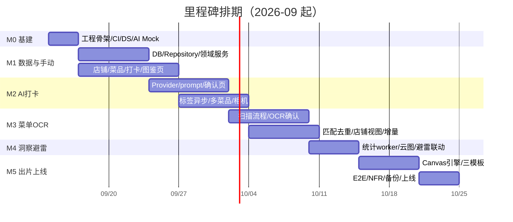

# 地球 Online 美食图鉴 · 开发任务清单（Dev Task List）

## 0. 说明

| 项目 | 内容 |
| --- | --- |
| 文档版本 | v1.0.0 |
| 编写日期 | 2026-09-12 |
| 依据文档 | PRD v1.0.0、技术设计文档（TDD）v1.0.0 |
| 排期假设 | 2 名前端/全栈（FE-A、FE-B）+ 0.5 名 AI/全栈（AI-E）+ 0.5 名设计/测试（D/QA），共 9 周（对应 PRD M1–M5） |
| 工时单位 | 人日（PD），1 PD = 1 人 1 个有效工作日；估算含自测，不含节假日缓冲 |
| 优先级 | **P0** 发布必做 / **P1** v1.0 尽量交付 / **P2** 可顺延 v1.1 |
| 状态图例 | ⬜ 未开始 / 🟦 进行中 / ✅ 完成 / ⛔ 受阻 |

**任务 ID 规则**：`T{里程碑}-{序号}`，里程碑：

- **M0** 项目基建（先行 3 天）
- **M1** 数据层与手动打卡链路（第 1–2 周）
- **M2** AI 拍照打卡（第 3–4 周）
- **M3** 菜单 OCR 与店铺图鉴（第 5–6 周）
- **M4** 洞察统计与避雷（第 7 周）
- **M5** 一键出片、NFR、联调上线（第 8–9 周）

**完成定义（DoD，适用于所有任务）**

1. 代码合入 `zxc`（稳定后合 `main`），通过 CI：lint + typecheck + 单测 + build；
2. P0 任务有关联测试（领域逻辑必须单测，核心链路必须 E2E）；
3. 涉及 PRD 交互的任务经设计/产品走查；
4. 任务分支命名 `feat/Txxx-xxx`，commit 信息带任务 ID；
5. 任务完成后在本文件勾选 `[x]` 并填写实际工时。

---

## 1. 任务总览（看板视图）

| 里程碑 | 周期 | P0 任务数 | 估算（人日，P0） | 出口准则 |
| --- | --- | --- | --- | --- |
| M0 基建 | 第 0 周（3 天） | 7 | 6.0 | CI 全绿，空壳可运行，AI Mock 可调通 |
| M1 数据与手动链路 | 第 1–2 周 | 11 | 15.5 | 无 AI 也能完成"建店→打卡→看图鉴"闭环 |
| M2 AI 打卡 | 第 3–4 周 | 9 | 13.0 | 拍照识别→确认→保存→标签，失败可降级 |
| M3 菜单 OCR | 第 5–6 周 | 8 | 13.5 | 扫描→确认→三态图鉴→增量更新 |
| M4 洞察与避雷 | 第 7 周 | 6 | 8.0 | 云图/占比/避雷三处联动、补标签批处理 |
| M5 出片与上线 | 第 8–9 周 | 9 | 15.0 | 三模板出片、E2E 全绿、发布准入 7 条全过 |
| **合计** | **9 周** | **50** | **71.0** | 另含 P1 任务约 11 PD（见第 8 节） |

> 按 2 名全职前端 9 周 ≈ 90 PD 容量计算，P0 71 PD 可容纳评审/联调/缓冲与 11 PD 的 P1，排期可行；AI-E 的接口与调优工作并行于 M0–M3。

---

## 2. M0 项目基建（第 0 周）

| ID | 任务 | 负责人 | 估时 | 依赖 | 验收标准 | 状态 |
| --- | --- | --- | --- | --- | --- | --- |
| T0-01 | 初始化 Vite + React + TS 工程，接入 Tailwind/Router/Zustand/Query/Dexie，按 TDD 2.4 建目录骨架 | FE-A | 1.0 | — | `pnpm dev` 可运行；strict TS 零报错 | ⬜ |
| T0-02 | ESLint flat config + Prettier + Husky + lint-staged + commit 规范 | FE-A | 0.5 | T0-01 | 提交自动检查；不通过无法 commit | ⬜ |
| T0-03 | GitHub Actions CI：install/lint/typecheck/test/build + PR 预览部署 | FE-A | 1.0 | T0-02 | PR 触发 CI 全绿，产出预览 URL | ⬜ |
| T0-04 | Vitest + Testing Library + Playwright（移动/桌面双视口工程） | FE-B | 1.0 | T0-01 | 一条示例单测与一条示例 E2E 跑通 | ⬜ |
| T0-05 | Design System 基座：基于 Radix 的 Button/Input/Sheet/Dialog/Chip/Empty/Toast + 主题变量（图鉴配色/暗色） | FE-B | 1.5 | T0-01 | 组件文档页可查看；44px 触控达标 | ⬜ |
| T0-06 | AI 基础设施：`AIProvider` 接口、zod DTO、错误归一化、Mock adapter（固定夹具）、超时/重试骨架 | AI-E | 0.75 | T0-01 | Mock 模式下调通 recognize 假响应 | ⬜ |
| T0-07 | 全局壳：底部导航（首页/图鉴/洞察/我的）、路由表与懒加载、ErrorBoundary、字体方案 | FE-B | 1.25 | T0-01, T0-05 | 四个空页面可切换；报错不白屏 | ⬜ |

---

## 3. M1 数据层与手动打卡链路（第 1–2 周）

> 出口：完全不接 AI，可手动完成 建店 → 手动打卡（评分/避雷/感想/图片）→ 图鉴三态浏览 → 菜品详情。

### 3.1 数据与领域

| ID | 任务 | 负责人 | 估时 | 依赖 | 验收标准 | 状态 |
| --- | --- | --- | --- | --- | --- | --- |
| T1-01 | Dexie schema v1 建表/索引 + 迁移机制 + IDB 可用性探测与内存降级提示 | FE-A | 1.0 | T0-01 | 各表 CRUD 冒烟通过；隐私模式有提示 | ⬜ |
| T1-02 | 实体类型与工厂函数（Restaurant/Dish/Log/Photo/MenuScan/OcrItem/Tag/UserProfile） | FE-A | 0.75 | T1-01 | 类型与 TDD 第 11 章一致；工厂默认值正确 | ⬜ |
| T1-03 | Repository 层：Restaurant/Dish/Log/Photo + 原子事务（打卡批量写） | FE-A | 2.0 | T1-02 | 打卡事务中途失败整体回滚（测试覆盖） | ⬜ |
| T1-04 | BlobStore 图片存储（IDB Blob 适配器 + 缩略图元信息）、配额 estimate 与持久化授权 | FE-B | 1.5 | T1-01 | put/get/usage 正常；配额不足可拦截 | ⬜ |
| T1-05 | 领域纯服务：`normalizeDishName`/`unlock.derive`/`avoid.evaluate`/评分聚合（均分/最近） | FE-A | 2.0 | T1-02 | 单测覆盖：避雷=任一低分或手标、删光 Log 回 locked | ⬜ |
| T1-06 | 标签受控词表（口味/菜系/食材/烹饪/场景）与归一化映射、自定义标签 | AI-E | 1.0 | T1-02 | 近义收敛（辣/很辣→麻辣规则）有测试 | ⬜ |

### 3.2 页面与交互

| ID | 任务 | 负责人 | 估时 | 依赖 | 验收标准 | 状态 |
| --- | --- | --- | --- | --- | --- | --- |
| T1-07 | 手动打卡表单：菜品名/店铺联想新建/星级半星/避雷开关联动/价格/感想/时间/场景 + 草稿 | FE-B | 2.0 | T1-03 | 评分≤2 自动开避雷；退出 24h 内可恢复 | ⬜ |
| T1-08 | 图片选择与前端压缩管线（image worker：缩放/EXIF/JPEG 两档/400 缩略图）+ blur 预检 | FE-B | 2.0 | T1-04 | 1600 长边、q0.82、输出尺寸达标；模糊图有提示 | ⬜ |
| T1-09 | 首页：总览统计条、最近打卡时间线、快捷入口、空态 | FE-B | 1.0 | T1-03 | 数据经 liveQuery 实时更新 | ⬜ |
| T1-10 | 图鉴页：网格三态（已解锁彩色/未解锁灰剪影/避雷红角标）、店铺/菜系/标签三视图、筛选排序、虚拟滚动 | FE-A | 2.5 | T1-03, T0-05 | 千条数据滚动 60fps；筛选条件入 URL query | ⬜ |
| T1-11 | 店铺详情（头部/进度等级/分区网格/避雷横幅）、菜品详情（画廊/评分/标签/Log 时间线/删除联动） | FE-A | 2.25 | T1-10 | 删 Log 后状态按 T1-05 规则重算；EC-DEX-03/04 正确 | ⬜ |

**M1 里程碑检查**：产品/QA 按出口准则走查；导出一份"手动链路演示数据"供后续 AI 联调。

---

## 4. M2 AI 拍照打卡（第 3–4 周）

> 出口：拍照/上传 → AI 识别（单/多菜品）→ 三档置信度确认 → 保存 → 标签异步回填；全部失败路径可手动降级。

| ID | 任务 | 负责人 | 估时 | 依赖 | 验收标准 | 状态 |
| --- | --- | --- | --- | --- | --- | --- |
| T2-01 | BFF 边缘函数：路由转发/Key 注入/请求体限制/限流/no-store/错误归一化；环境变量与直连模式开关 | AI-E | 1.5 | T0-06 | 生产仅 BFF 可调；直连模式仅开发可用 | ⬜ |
| T2-02 | recognize prompt v1（多菜品/候选/bbox/hasFood/强 JSON）+ 真实供应商联调与 bad case 夹具沉淀 | AI-E | 2.0 | T2-01 | 30 张样本菜名采纳率 ≥60%（高置信口径），响应 P95 ≤6s | ⬜ |
| T2-03 | 识别结果确认页：置信度三档 UI、Top3 候选、低置信必填、多菜品勾选/合并/改名/手添 | FE-B | 2.5 | T2-02, T1-07 | EC-CAP-10~14 全部用例通过 | ⬜ |
| T2-04 | createLogWorkflow：识别编排、15s 超时降级、保存事务接 M1、AI 快照落库 | FE-A | 1.5 | T2-03 | 断网/超时自动转手动且图片草稿不丢 | ⬜ |
| T2-05 | 标签提取：tags prompt（词表下发/custom 分流）、AsyncQueue（退避重试/终态）、保存不阻塞、回填 UI | AI-E + FE-A | 2.0 | T2-04, T1-06 | pending→done/failed 状态机正确；失败可手动重试 | ⬜ |
| T2-06 | 标签确认交互（Chip 增删改、<0.6 进"AI 还猜了"、自由标签） | FE-B | 1.0 | T2-05 | EC-TAG-01~03 通过 | ⬜ |
| T2-07 | 移动端相机：getUserMedia 预览/快门、权限拒绝引导、非 HTTPS 降级、多图 ≤9 限制 | FE-B | 1.5 | T1-08 | EC-CAP-01/02/04 通过 | ⬜ |
| T2-08 | 解锁动效（首解）/追加打卡态（"第 N 次"）、识别中可取消进度态 | FE-B | 0.75 | T2-04 | 新菜触发动效；同名菜走追加不重建 | ⬜ |
| T2-09 | 本地埋点补齐 + 识别全链路耗时日志（事件见 TDD 7.5） | FE-A | 0.75 | T2-04 | 事件可在设置页导出，不含图片内容 | ⬜ |

**M2 里程碑检查**：PRD EC-CAP-01~14、EC-TAG-01~03 逐条 QA 验收；弱网（DevTools  throttling + offline）专项。

---

## 5. M3 菜单 OCR 与店铺图鉴（第 5–6 周）

> 出口：传菜单 → 分区 OCR → 人工确认 → 建菜（未解锁灰态）→ 店铺进度/避雷视图；重复扫描走增量 diff。

| ID | 任务 | 负责人 | 估时 | 依赖 | 验收标准 | 状态 |
| --- | --- | --- | --- | --- | --- | --- |
| T3-01 | 菜单上传页：多图（≤10/≤10MB）、清晰/反光预检提示、手动旋转 90°（P1）、店铺选择/新建 | FE-B | 1.5 | T1-08 | EC-MENU-01/02 提示正确 | ⬜ |
| T3-02 | menu-scan prompt v1（分区/菜名/价格/规格/不可读区域/酒水归类）+ 多图真实菜单联调 | AI-E | 2.5 | T2-01 | 20 份真实菜单（含纸质反光/中英混排）结构化可用率 ≥70% | ⬜ |
| T3-03 | OCR 确认页：分区折叠清单、行内改名/改价/改分区/删除、不可读区块高亮与重扫、手添 | FE-B | 3.0 | T3-02 | 低置信行必须处理才能保存；EC-MENU-03/04 通过 | ⬜ |
| T3-04 | 匹配引擎：相似度（Levenshtein+bigram Jaccard+包含）、exact/fuzzy/new 分支、fuzzy 合并弹窗 | FE-A | 2.0 | T1-05 | 评分阈值（0.8/0.95）单测矩阵；跨店不误合并 | ⬜ |
| T3-05 | 人工保护与 upsert：`nameSource=user` 只读建议、OcrItem→Dish 事务、规格多价 | FE-A | 1.25 | T3-04 | EC-MENU-06/07 通过；无 userDecision 不得建菜 | ⬜ |
| T3-06 | 增量扫描 diff（added/removed/renamed）与扫描历史 | FE-A | 1.5 | T3-05 | EC-MENU-05：二次扫描只确认差异，旧菜默认保留 | ⬜ |
| T3-07 | 店铺详情菜单视图完善：分区网格、进度条与五档等级文案、100% 制霸态 | FE-B | 1.0 | T1-11, T3-05 | 扫描后进度实时正确；无菜单空态 CTA（EC-DEX-01/02） | ⬜ |
| T3-08 | 扫描 Workflow 草稿/失败/部分不可读兜底，OCR 超时 20s/张降级手录 | FE-A | 0.75 | T3-03 | 退出恢复；完全失败可手录，图片保留 | ⬜ |

**M3 里程碑检查**：用同一店铺两轮真实菜单做增量验收；EC-MENU-01~07 全通过。

---

## 6. M4 数据可视化与避雷提醒（第 7 周）

| ID | 任务 | 负责人 | 估时 | 依赖 | 验收标准 | 状态 |
| --- | --- | --- | --- | --- | --- | --- |
| T4-01 | stats.worker：近 365 天标签/菜系占比（维度内归一）、总览、店铺均分、streak；statCache + SWR 失效 | FE-A | 2.0 | M1 全部 | 口径与 PRD 5.4.1 一致；分母 0 显示「—」；大数组不卡主线程 | ⬜ |
| T4-02 | 洞察页：总览卡、环形图、标签云（语义色/下钻）、趋势图（P1） | FE-B | 1.75 | T4-01 | <5 条数据空态引导（EC-INS-01）；图表 tooltip 明示口径 | ⬜ |
| T4-03 | 避雷库页面（按店分组/短评/撤销）与避雷三处联动（横幅、打卡前 fuzzy 提示、搜索角标） | FE-B + FE-A | 2.0 | T3-04 | 三处实时生效/撤销即时解除；EC-INS-03 通过 | ⬜ |
| T4-04 | 「一键补全历史标签」批处理（jobs 队列 + 进度条 + 失败续跑） | AI-E | 1.0 | T2-05 | EC-INS-02；中途关闭页面回来可续跑 | ⬜ |
| T4-05 | AI 味蕾总结文案（3 段式/换一换）[P1] | AI-E | 0.75 | T4-01 | 数据不足时不出文案；文案不含负面标签滥用 | ⬜ |
| T4-06 | 搜索（店铺/菜品，避雷角标命中） | FE-A | 1.25 | T1-03 | 本地模糊搜索 ≤100ms；避雷项不被折叠 | ⬜ |

---

## 7. M5 一键出片、NFR 与发布（第 8–9 周）

| ID | 任务 | 负责人 | 估时 | 依赖 | 验收标准 | 状态 |
| --- | --- | --- | --- | --- | --- | --- |
| T5-01 | CardRenderer 引擎：模板节点树（背景/图框/文本/徽章/Chips/条件显隐）、@2x 离屏绘制、字体 ready 后导出 | FE-A | 2.5 | T2-04 | 无图/缺字段自动重排无空块；EC-CARD-04/05 截图回归通过 | ⬜ |
| T5-02 | 模板 A 经典图鉴（编号 No./稀有度角标/星级/标题副标题/标签/成就文案/水印） | FE-B + D | 1.5 | T5-01 | 对齐 PRD 8.2/8.3；1080×1440 PNG 导出 | ⬜ |
| T5-03 | 模板 B 霓虹夜市、模板 C 米其林留白 + 避雷"雷品警报"皮肤 | FE-B + D | 2.0 | T5-02 | 三模板 × 有图/无图/避雷 视觉回归基线 | ⬜ |
| T5-04 | 出片交互：模板横滑、字段开关、AI 成就文案换一换（P1）、保存（a.download/FSA）、Web Share 降级 | FE-B | 1.25 | T5-02 | iOS Safari/安卓 Chrome 均可保存；不支持分享时长按提示 | ⬜ |
| T5-05 | 数据备份：JSON 导出（图片 base64/仅数据分卷）、导入预览与同构冲突确认、版本兼容校验 | FE-A | 2.0 | T3-05 | 清空浏览器后导入完整恢复（发布准入 #7）；高版本拒绝导入 | ⬜ |
| T5-06 | 存储管理（占用展示/仅留近一年图/清空图片保文字）、设置页（AI 配置/免责/水印/修复数据 recomputeAll） | FE-B | 1.0 | T1-04 | 清理后文字记录与图鉴状态不受影响 | ⬜ |
| T5-07 | NFR 收口：性能（分包/懒加载/Web Vitals）、响应式走查 360–1440、无障碍（对比度/缩放/双通道）、CSP/PWA App Shell | FE-A + FE-B | 2.0 | 全部功能 | Lighthouse 移动端性能 ≥85；125% 字号不破版 | ⬜ |
| T5-08 | E2E 全量与验收：PRD 10.1 七条准入各 ≥1 用例；弱网/隐私模式/配额不足异常流；多机型真机抽检 | QA + 全员 | 2.0 | 以上全部 | 七条准入 100% 通过；P0/P1 缺陷清零 | ⬜ |
| T5-09 | 发布：生产构建与静态部署、BFF 密钥配置、版本号/埋点校验、监控与回滚预案、应用内更新提示 | FE-A | 0.75 | T5-08 | 线上冒烟清单通过；可一键回退上一版本 | ⬜ |

---

## 8. P1 / P2 备选任务（资源允许时插入，不阻塞发布）

| ID | 任务 | 优先级 | 估时 | 建议插入点 | 状态 |
| --- | --- | --- | --- | --- | --- |
| TX-01 | 图片本地 hasFood 轻量模型预检 | P1 | 1.5 | M2 后期 | ⬜ |
| TX-02 | 菜单透视裁剪/手动旋转增强 | P1 | 1.0 | T3-01 | ⬜ |
| TX-03 | 近 6 个月口味/评分趋势图 | P1 | 1.0 | T4-02 | ⬜ |
| TX-04 | AI 成就文案生成 | P1 | 0.75 | T5-04 | ⬜ |
| TX-05 | 打卡震动反馈、音效与更多解锁动效 | P1 | 0.75 | M5 | ⬜ |
| TX-06 | 出片 JPEG 小尺寸版本 | P1 | 0.5 | T5-04 | ⬜ |
| TX-07 | 视觉回归截图 CI 化 | P1 | 1.0 | M5 | ⬜ |
| TX-08 | 云端同步/账号体系预研（syncState 联调） | P2 | — | v1.1 立项 | ⬜ |
| TX-09 | LBS 附近店铺与地图 | P2 | — | v1.x | ⬜ |
| TX-10 | 好友图鉴/社交 | P2 | — | v2.0 | ⬜ |

---

## 9. 人员并行建议（典型周安排）

| 周 | FE-A（偏架构/数据） | FE-B（偏交互/视觉） | AI-E（0.5 投入） |
| --- | --- | --- | --- |
| 0 | T0-01/02/03 | T0-04/05/07 | T0-06 |
| 1 | T1-01~03、T1-05 | T1-04、T1-08 | T1-06 词表 |
| 2 | T1-10/11 | T1-07/09 | 配合夹具数据 |
| 3 | T2-04（串接） | T2-03/07 | T2-01/02 |
| 4 | T2-05/09 | T2-06/08 | T2-05 队列联调 |
| 5 | T3-04/05 | T3-01/03 | T3-02 |
| 6 | T3-06/08 | T3-03/07 | bad case 迭代 |
| 7 | T4-01/03/06 | T4-02/03 | T4-04/05 |
| 8 | T5-01/05 | T5-02/03/04 | 文案/模型质量收尾 |
| 9 | T5-07/09 | T5-06/08 | 上线支持 |

---

## 10. 风险跟踪清单

| 风险 | 等级 | 应对 | 责任人 | 状态 |
| --- | --- | --- | --- | --- |
| 真实菜单 OCR 准确率不达 70% | 高 | M3 第 1 周即用 20 份真实菜单评测；不行则强化"手动补录+分区重扫"体验 | AI-E | ⬜ |
| 高置信菜名采纳率不达 60% | 中 | M2 样本评测前置，调 prompt/换供应商横评（aiSnapshot 已有追溯） | AI-E | ⬜ |
| Canvas 中文字体体积拖慢首屏 | 中 | 子集化 + swap，出片字体只在出片 chunk 加载 | FE-B | ⬜ |
| 两名 FE 并行代码冲突 | 低 | 目录按 TDD 2.4 强隔离；领域层先冻结接口（M1 第 2 天评审） | FE-A | ⬜ |
| IDB 数据被系统清理 | 中 | persist 授权 + 备份引导（T5-05/06） | FE-A | ⬜ |

---

## 11. 验收用例追踪（PRD 发布准入 7 条 → 任务）

| PRD 10.1 准入 | 覆盖任务 | E2E 用例 |
| --- | --- | --- |
| 1. 高置信单菜品 3 次点击内完成 | T2-03/04/07 | E2E-CAP-HAPPY |
| 2. AI 失败全链路手动降级、草稿不丢 | T2-04/07、T3-08 | E2E-AI-FALLBACK |
| 3. 菜单扫描三态正确、精确匹配不重复 | T3-03/04/05/07 | E2E-MENU-STATES |
| 4. 避雷三处联动可撤销 | T4-03 | E2E-AVOID-LINKS |
| 5. 云图/占比口径正确、小数据空态 | T4-01/02 | E2E-INSIGHTS |
| 6. 三模板海报多机型导出正常 | T5-01~04 | E2E-CARD-EXPORT + 视觉回归 |
| 7. JSON 备份清空后可恢复 | T5-05 | E2E-BACKUP-RESTORE |

---

## 12. 使用方式

- 每日站会按本清单过状态（⬜/🟦/✅/⛔），受阻项必须写明阻塞原因与责任人；
- 每个任务完成：勾选 `[x]`（或修改状态列为 ✅）、PR 关联任务 ID；
- 估时偏差 >50% 的任务在复盘时备注原因，用于校准后续估算；
- 新增需求一律先入第 8 节备选池并经产品确认，禁止直接插入进行中的里程碑。

*清单结束。与 PRD v1.0.0、TDD v1.0.0 配套使用。*
