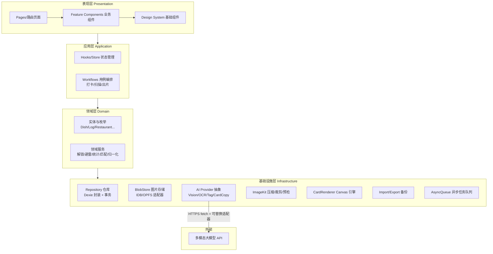
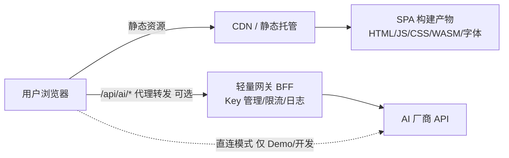
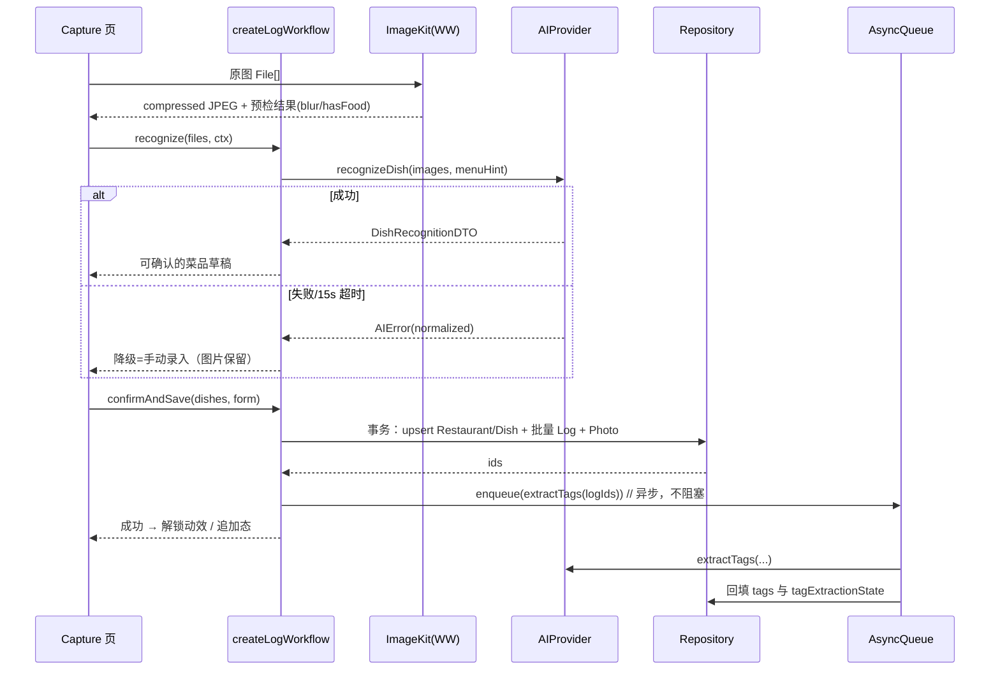

# 地球 Online 美食图鉴 · 技术设计文档（TDD）

## 0. 文档信息

| 项目 | 内容 |
| --- | --- |
| 产品名称 | 地球 Online 美食图鉴（FoodDex） |
| 文档版本 | v1.0.0 |
| 编写日期 | 2026-09-12 |
| 对应 PRD | [PRD-地球Online美食图鉴.md](./PRD-地球Online美食图鉴.md) v1.0.0 |
| 文档目标 | 明确 v1.0 的技术选型、系统架构、模块设计、数据层、AI 服务接入、关键算法、接口契约、非功能落地方案，作为开发实施与 Code Review 的技术基准 |
| 适用读者 | 前端工程师、全栈工程师、AI 工程师、QA、架构评审人 |

### 0.1 术语缩写

| 缩写 | 含义 |
| --- | --- |
| SPA | Single Page Application |
| IDB | IndexedDB |
| OPFS | Origin Private File System（图片 Blob 备选存储） |
| DEX | 数据访问层（Data Access），同时也是"图鉴"双关 |
| OCR | 光学字符识别（菜单识别场景） |
| VLM | Vision-Language Model，多模态视觉大模型 |
| SWR | Stale-While-Revalidate 缓存策略 |
| WW | Web Worker |

---

## 1. 技术目标与约束映射

| PRD 约束/目标 | 技术对策 |
| --- | --- |
| 纯 Web、响应式、移动优先 | SPA + 移动端断点优先；摄像头 `getUserMedia`；移动端触控规范 |
| 不依赖第三方点餐/外卖 API | 仅对接可替换的多模态 AI 服务；业务数据全部用户自产 |
| 数据本地化、轻量独立 | IndexedDB 结构化数据 + Blob 图片本地持久化；无强制账号体系 |
| AI 拍照识别 ≤ 6s、OCR ≤ 10s、可降级 | AI Provider 抽象层 + 超时/重试/手动降级三件套 |
| 一键出片离线可用、1.5s 内渲染 | 本地 Canvas 模板引擎，Web Font 预载，不经过服务端合成 |
| 千级菜品列表流畅 | 虚拟滚动 + 缩略图 + 派生统计缓存 |
| 未来云同步不推翻模型 | 所有表带 `syncState/updatedAt`，ID 全局唯一 UUID，仓库层预留同步接口 |

---

## 2. 总体架构

### 2.1 架构分层



**分层规则**

1. 表现层不直接访问 IDB/fetch，只调用 Workflows / Store Actions；
2. 领域服务保持纯函数优先（匹配、归一化、统计），便于单测；
3. 基础设施层所有外部副作用（AI、存储）以接口（TS interface）暴露，业务层依赖接口而非实现；
4. AI Provider 以**依赖注入 + 适配器**方式接入，换供应商只改一个 adapter 文件。

### 2.2 部署形态



- **纯静态托管**：产物可部署到 GitHub Pages / Vercel / Netlify / Nginx；
- **AI 密钥安全**：生产环境经一个极薄 BFF（推荐 Cloudflare Workers / Vercel Edge Function）转发，Key 不下发浏览器；BFF 只做鉴权（v1.0 可选设备码）、限流、供应商路由与错误归一化；
- 无业务数据库、无服务端账号体系；BFF 不落业务数据。

### 2.3 技术栈选型

| 层 | 选型 | 版本/约束 | 选型理由 |
| --- | --- | --- | --- |
| 语言 | TypeScript | TS 5.x，`strict: true` | 领域模型复杂，强类型保障 Schema 一致性 |
| 框架 | React | 18.x（函数组件 + Hooks） | 生态成熟、虚拟滚动/Canvas 库丰富 |
| 构建 | Vite | 5.x | 冷启动快、Web Worker 与 WASM 集成简单 |
| 路由 | React Router | v6 data router | 懒加载、loader 预取 |
| 状态 | Zustand | 4.x | 轻量；配合 React Query 管理服务端态 |
| 服务端态 | TanStack Query | 5.x | AI 请求缓存、重试、突变状态 |
| 本地数据库 | Dexie.js（IndexedDB） | 4.x | 事务/索引/版本迁移 API 成熟 |
| 文件存储 | IDB Blob（主）/ OPFS（适配） | — | 图片 Blob 与记录分离，便于清理 |
| UI 组件 | 自研 DS + Radix Primitives | — | 无样式逻辑基座，视觉完全自定义（图鉴风） |
| 样式 | Tailwind CSS + CSS Variables | 3.x | 响应式工具类 + 主题变量 |
| 图表 | ECharts | 5.x | 环形图/云图扩展（echarts-wordcloud） |
| 动画 | Framer Motion | 11.x | 解锁动效、页面转场 |
| Canvas 出片 | 原生 Canvas 2D + `@napi-rs/*` 不适用浏览器，纯前端 | — | 模板 JSON 驱动；字体用 FontFace API |
| 图片处理 | `browser-image-compression` + 自研预检 | — | 压缩；模糊检测用拉普拉斯方差（WW 内 Canvas） |
| 图标 | Lucide React | — | 轻量 tree-shaking |
| 测试 | Vitest + Testing Library + Playwright | 最新稳定 | 单测/组件/E2E |
| 代码质量 | ESLint(flat config) + Prettier + TypeScript + Husky + lint-staged | — | 提交门禁 |
| CI/CD | GitHub Actions | — | lint/typecheck/test/build/部署 |
| PWA（部分） | Vite PWA plugin（仅 App Shell 缓存） | — | v1.0 不做离线 AI，只保证已加载页面可用 |

> 说明：若团队为 Vue 生态，可平替为 Vue3 + Pinia + Vue Router，架构分层不变；本文以 React 技术栈给出门禁与示例。

### 2.4 目录结构

```text
fooddex/
├─ index.html
├─ vite.config.ts
├─ src/
│  ├─ main.tsx
│  ├─ app/                    # 路由、全局 Provider、主题
│  │  ├─ router.tsx
│  │  └─ providers.tsx
│  ├─ pages/                  # 与 IA 对应的页面
│  │  ├─ home/  dexDex/  restaurant/  dish/  insights/  capture/  scan/  settings/
│  ├─ features/               # 功能模块（组件 + 局部 hooks）
│  │  ├─ capture/  scan-menu/  dex-grid/  rating/  tags/  insights/  share-card/
│  ├─ domain/
│  │  ├─ entities/            # Dish/Log/Restaurant/... 类型与工厂
│  │  ├─ services/            # unlock.ts / avoid.ts / stats.ts / matcher.ts / normalize.ts
│  │  └─ vocab/               # 标签受控词表、菜系表、避雷规则
│  ├─ application/
│  │  ├─ workflows/           # createLogWorkflow.ts / scanMenuWorkflow.ts ...
│  │  └─ stores/              # zustand stores（UI 态为主）
│  ├─ infra/
│  │  ├─ db/                  # Dexie schema、迁移、repository
│  │  ├─ blob/                # BlobStore（idb / opfs 适配器）
│  │  ├─ ai/
│  │  │  ├─ types.ts          # AIProvider 接口、DTO
│  │  │  ├─ provider.ts       # 路由/超时/重试/错误归一化
│  │  │  ├─ prompts/          # 识别/OCR/标签/文案 prompt 模板
│  │  │  └─ adapters/         # vendorX.ts / mock.ts
│  │  ├─ image/               # compress.ts / quality.ts / thumbnail.ts（worker）
│  │  ├─ card/                # renderCard、templates/*.ts、字体加载
│  │  ├─ queue/               # AsyncQueue（标签补全/批量补标签）
│  │  ├─ backup/              # JSON 导入导出
│  │  └─ analytics/           # 本地埋点队列（默认不外发）
│  ├─ ui/                     # Design System：Button/Chip/Stars/Sheet/Empty...
│  ├─ styles/
│  └─ workers/                # image.worker.ts / stats.worker.ts
├─ public/fonts/              # 可商用 Web Font（含出片标题字）
├─ tests/
│  ├─ unit/  component/  e2e/
└─ .github/workflows/ci.yml
```

---

## 3. 前端关键设计

### 3.1 路由与页面映射（对应 PRD 第 4 章）

| 路径 | 页面 | 关键 loader / action |
| --- | --- | --- |
| `/` | 首页 | loader：最近 8 条 Log、总览统计 |
| `/dex` | 图鉴总览 | 筛选条件走 query string（`?view=shop&filter=avoid`），可分享/回退 |
| `/dex/cuisine/:cuisine` | 菜系视图 | loader：该菜系聚合 |
| `/r/:restaurantId` | 店铺详情 | loader：店铺 + 分区菜单 + 避雷 id 集合 |
| `/d/:dishId` | 菜品详情 | loader：菜品 + Log 时间线 |
| `/capture` | 极速打卡（独立全屏流程） | 草稿从 sessionStorage/IDB 恢复 |
| `/scan/:restaurantId?` | 菜单扫描 | 多步状态机：upload → ocr → confirm |
| `/insights` | 洞察 | stats worker 计算结果缓存 |
| `/settings` | 我的 | — |

路由级代码分割；`/capture`、`/scan` 预加载 AI 相关 chunk（在首页挂载后 `requestIdleCallback` 内 idle prefetch）。

### 3.2 状态管理分工

| 状态类型 | 归属 | 示例 |
| --- | --- | --- |
| 服务端态（AI 请求） | TanStack Query mutation/query cache | 识别结果（短期）、OCR 结果（流程内） |
| 持久业务数据 | Repository（Dexie）+ 订阅式 hook（`useLiveQuery`） | Dish/Log/Restaurant，写后自动刷新视图 |
| UI 瞬态 | Zustand | 弹层、筛选器、相机流开关 |
| 流程草稿 | Dexie 表 `draft` + Workflow 自动保存 | 打卡/扫描中途退出恢复 |

原则：**唯一事实源在 IDB**；Zustand 不缓存业务实体的副本，只存 id 列表与筛选条件。

### 3.3 打卡 Workflow（PRD 3.1 的落地）



要点：

- **保存事务原子化**：Restaurant、Dish、Log、Photo 在一个 Dexie 事务内提交，失败整体回滚；
- **标签异步化**：Log 先以 `tagExtractionState: pending` 落库，队列重试（指数退避 2/5/15s，最多 3 次，终态 `failed` 可手动重试）；
- **解锁判定**：Dish 首条 Log 提交成功时在事务内置 `status=unlocked`、`unlockedAt=now`，由领域服务 `unlock.derive(dish, logs)` 单一来源计算，避免多处写状态不一致；
- **避雷判定**：`avoid.evaluate(rating, manualAvoid)`，任一条 Log 命中则 Dish `isAvoid=true`，撤销时重新聚合全部 Log 计算（不能只看最新一条）。

### 3.4 菜单扫描 Workflow 与匹配算法

**流程状态机**：`upload → preview → ocr(loading) → confirm(editing) → saving → done`（任意态可回退，结果入 `draft`）。

**菜名归一化 `normalizeDishName(raw)`**

1. Unicode NFKC 规范化，全角转半角，英文小写化仅用于比较（不改显示名）；
2. 去除尾部规格：正则 `[/／](例|份|位|大|小|例牌|大份|小份)$`、`[（(](大|中|小|例)[)）]$`；
3. 去除价格残留与装饰符号：`[¥￥$]?\d+(\.\d+)?`、`[★※◆◇▪▫·•\-—_]{2,}`；
4. 括号内容拆分：主名保留，括号内容入 `aliases`（如「黑椒牛柳（辣）」）；
5. 空白压缩。

**匹配 `matchOcrItem(item, existingDishes)`**

```text
score = 0
if normalize(a) === normalize(b):                 score = 1.00        // exact
else:
    lev = levenshteinRatio(normA, normB)          // 编辑距离相似度
    jac = bigramJaccard(normA, normB)             // 二元组 Jaccard，抗字序
    contain = 包含关系且长度差 ≤ 2 字 → 0.85
    score = max(0.6*lev + 0.4*jac, contain)
分支: score ≥ 0.95 → 自动合并提示（可撤销）
      0.80 ≤ score < 0.95 → fuzzy，必须用户确认 merged / keptSeparate
      否则 → new（未解锁）
```

- 匹配范围仅**同 restaurantId**；跨店同名只关联 `canonicalDishId`（由标准名映射表 `canonicalMap` 查询，不做自动建并）；
- **人工保护**：`dish.nameSource === 'user'` 时，重扫的改名建议只能进 `renamed 候选`，禁止覆盖；
- **增量扫描 diff**：以现存菜品集合为基准，新 OCR 集合做上述匹配，输出 `{added[], removed[], renamed[]}`，removed 仅标记不物理删除（用户确认后才删）。

### 3.5 统计与洞察

- 重计算放 `stats.worker.ts`，输入 Log + Dish 快照，输出不可变统计结果；
- 结果缓存到 IDB 表 `stat_cache`（key = 口径+月份，value 含 `dataVersion/hash`）；数据变更（写事务成功）后使相关缓存失效（SWR：先渲染缓存，后台重算）；
- 口径严格实现 PRD 5.4.1：
  - 口味/菜系占比 = 近 365 天 Log 关联标签在**同维度内**归一；`cuisine.primary` 单选口径用于菜系环形图；
  - 连续打卡：按 `ateAt` 转本地自然日去重，从最近一天向前数连续日；
  - 分母 0 → 返回 `null`（UI 显示「—」）；
- 云图：`echarts-wordcloud`，字号权重 `14 + sqrt(freq) * k`，颜色按口味语义色映射表。

### 3.6 图片管线

```text
File
 ├─ decode(Worker, createImageBitmap)
 ├─ 方向纠正（EXIF orientation）
 ├─ 长边 >1600 → 等比缩放
 ├─ 质量预检：灰度化 → Laplacian 方差 < 阈值 → blur=true
 ├─ 输出原图档 JPEG q0.82（≤约 500KB 目标，超限再降档 q0.75）
 └─ 生成缩略图 400px 长边 q0.7（列表用）
```

- hasFood 预检：v1.0 若端侧无模型则**不阻塞**，仅依赖云端识别返回的 `hasFood`；本地只做 blur；
- 存储：`BlobStore` 接口 `put/get/delete/usage`，默认 IDB Blob 适配器；封装 OPFS 适配器作为后续大图方案；
- 配额管理：保存前 `navigator.storage.estimate()`，不足拦截并引导（PRD EC-CAP-07）；`persist()` 请求持久化存储授权防清理。

### 3.7 一键出片引擎（CardRenderer）

- 模板即数据：每个模板是一个纯 JSON/TS 对象（背景层、图片框、文本节点、徽章、标签行、条件显隐规则）；
- 渲染器遍历节点树绘制到离屏 Canvas（@2x），文本测量、省略号、多行截断内置；
- 字体：`document.fonts.load()` 收集标题/正文两族 → `document.fonts.ready` 后再导出，避免回退字体（EC-CARD-05）；
- 图片同源：Blob 一律 `URL.createObjectURL` 本地加载，导出前 `ctx.getImageData(1,1,1,1)` 探测污染（EC-CARD-04）；
- 导出 `canvas.toBlob('image/png')` → 下载（File System Access API 可用时优先给"保存"，否则 `<a download>`）；分享走 `navigator.share({files})`，不支持显示长按提示；
- 避雷皮肤：评分 ≤2 或 `isAvoid` 切换 `dex_warning` 主题变量（黄黑斜纹、暗灰底）；
- 所有绘制函数纯函数化（输入数据+模板 → ImageBitmap），便于快照单测。

---

## 4. 数据层设计

### 4.1 Dexie Schema（v1）

```ts
// infra/db/schema.ts
db.version(1).stores({
  userProfile:  'id',
  restaurants:  'id, name, updatedAt',
  dishes:       'id, restaurantId, canonicalDishId, status, isAvoid, unlockedAt, updatedAt',
  logs:         'id, dishId, restaurantId, ateAt, createdAt',
  photos:       'id, refType, refId, isCover, createdAt',
  menuScans:    'id, restaurantId, status, createdAt',
  ocrItems:     'id, scanId, sourceImageId, matchResult.type',
  tagVocab:     'key, dim',          // 受控词表缓存/自定义标签
  drafts:       'id, type, updatedAt',
  statCache:    'key',
  jobs:         'id, type, status, runAt',  // AsyncQueue 持久化
  kv:            'key'
});
```

- 索引对应 PRD 7.9；复合条件查询（如"本店 + 避雷"）用 Dexie `where('restaurantId')` + 内存过滤或新增复合索引（按性能实测再迭代）；
- 图片 Blob 独立表/适配器，不与业务记录同事务大对象耦合；Photo 行只存 `blobKey` 与元信息。

### 4.2 Repository 接口（业务层只面向接口）

```ts
interface RestaurantRepo {
  create(input: RestaurantInput): Promise<Restaurant>;
  get(id: string): Promise<Restaurant | undefined>;
  search(keyword: string, limit?: number): Promise<Restaurant[]>;
  update(id: string, patch: Partial<Restaurant>): Promise<void>;
  remove(id: string, opts: { keepLogs?: boolean }): Promise<void>;
}

interface DishRepo {
  listByRestaurant(rid: string): Promise<Dish[]>;
  listByFilter(q: DexFilter): Promise<Dish[]>;        // 视图/筛选/排序
  upsertFromOcr(rid: string, items: ResolvedOcrItem[]): Promise<{created: string[]; linked: string[]}>;
  setAvoid(id: string, avoid: boolean): Promise<void>;
  recomputeDerived(dishId: string): Promise<void>;    // 由 logs 重算 status/isAvoid/stats
}

interface LogRepo {
  addMany(input: AddLogInput[]): Promise<Log[]>;      // 打卡事务入口
  listByDish(dishId: string): Promise<Log[]>;
  remove(id: string): Promise<void>;                  // 删除后触发 recompute
}
```

**派生数据维护策略**：`stats/status/isAvoid` 均为可重算的派生字段。写路径在事务内调用领域纯函数同步更新；并提供 `recomputeAll()` 修复入口（设置页"修复数据"），保证任何历史脏数据可自愈。

### 4.3 数据库迁移

- 每个版本一个 `version(n).upgrade(tx => ...)`；迁移必须幂等、可重入；
- 迁移内禁止调用 AI/网络；大批量回填分批事务（每批 200 行）避免长事务；
- 发版前在测试中准备 v( n-1 ) 真实数据快照做升级回放。

### 4.4 导入导出

- 导出：`{ app:'fooddex', schemaVersion:1, exportedAt, data:{...tables}, photos?: 'base64'|'none' }`；图片随包时分卷（每卷 ≤ 50MB）打包提示；
- 导入：走与 OCR 同构的冲突检测——同店同菜归一化精确匹配则合并，fuzzy 弹确认；导入在预览确认后于单个大事务（分批）提交；
- 高版本数据导入低版本客户端：读 `schemaVersion`，仅允许 ≤ 当前版本，否则提示升级。

---

## 5. AI 服务接入设计

### 5.1 Provider 抽象

```ts
// infra/ai/types.ts
export interface AIProvider {
  recognizeDish(req: RecognizeReq, signal?: AbortSignal): Promise<RecognizeResp>;
  scanMenu(req: MenuScanReq, signal?: AbortSignal): Promise<MenuScanResp>;
  extractTags(req: TagReq, signal?: AbortSignal): Promise<TagResp>;
  generateCardCopy(req: CopyReq, signal?: AbortSignal): Promise<CopyResp>;
}

export type AIErrorCode =
  | 'TIMEOUT' | 'NETWORK' | 'RATE_LIMITED' | 'AUTH'
  | 'BAD_OUTPUT' | 'NO_FOOD' | 'UNKNOWN';
export class AIError extends Error { code: AIErrorCode; retriable: boolean; vendorCode?: string }
```

- `AIProviderRouter` 组合：`circuitBreaker → retry → timeout(AbortController) → adapter`；
- 重试：仅对 `NETWORK/TIMEOUT/RATE_LIMITED` 重试 1 次（抖动退避）；识别类不做多次自动重试以免用户久等（PRD 6.2）；
- 超时阈值：recognize 15s（UX 降级阈值；模型侧目标 P95 6s）、OCR 20s/张、tags 10s；
- 输出校验：所有 DTO 用 **zod** schema 校验，不合规 = `BAD_OUTPUT`，按失败处理进入降级；
- Mock adapter：固定夹具响应 + 可注入失败模式，供 E2E 与离线开发使用。

### 5.2 请求/响应契约（前端 ← BFF/模型）

**5.2.1 菜品识别** `POST /api/ai/recognize`

```jsonc
// request
{ "images": ["<jpeg base64 or multipart files>", "..."],
  "context": { "restaurantId": "rst_9f2c1a",
               "menuHints": ["水煮牛肉", "夫妻肺片"] } }
// response
{ "requestId": "req_01",
  "results": [
    { "imageIndex": 0, "imageQuality": { "blur": false, "hasFood": true },
      "dishes": [
        { "name": "水煮牛肉", "confidence": 0.91,
          "candidates": ["水煮牛肉", "水煮鱼", "毛血旺"], "bbox": [120,80,900,760] }
      ] }
  ],
  "model": { "vendor": "vendor-x", "version": "vision-2026-08" } }
```

**5.2.2 菜单 OCR** `POST /api/ai/menu-scan`

```jsonc
// response（对齐 PRD 6.3）
{ "requestId": "req_02",
  "results": [{
    "imageIndex": 0,
    "sections": [{ "name": "招牌菜",
      "items": [{ "name": "水煮牛肉", "price": 58, "spec": "例",
                  "confidence": 0.88, "bbox": [120,340,720,404] }] }],
    "unreadableRegions": [[40,900,1040,1180]]
  }],
  "model": { "vendor": "vendor-x", "version": "ocr-2026-07" } }
```

**5.2.3 标签提取** `POST /api/ai/tags`

```jsonc
// request
{ "images": ["..."], "dishName": "水煮牛肉", "comment": "麻味很正",
  "sceneHint": "聚餐", "vocabVersion": "2026.09" }
// response
{ "tags": {
    "taste":   [{ "value": "麻辣", "confidence": 0.93 }],
    "cuisine": { "primary": { "value": "川菜", "confidence": 0.97 },
                 "secondary": [{ "value": "火锅", "confidence": 0.55 }] },
    "ingredient": [{ "value": "牛肉", "confidence": 0.9 }],
    "cooking":    [{ "value": "水煮", "confidence": 0.8 }],
    "scene":      [{ "value": "聚餐", "confidence": 0.7 }],
    "custom":     [{ "value": "下饭", "confidence": 0.62 }] } }
```

### 5.3 Prompt 工程约定

- prompts 版本化目录管理（`recognize.v1.ts`），出参强制 JSON（function-calling / response-format json），系统提示内置：只输出 JSON、置信度必须诚实、菜名用中文全称、不得编造价格；
- 菜单 prompt 附带分区示例（few-shot）与"酒水茶位归入其他"规则；
- 标签 prompt 下发受控词表摘要（按当前量级全量下发约 2–4KB），并要求表外标签必须放 `custom`；
- 每次响应记录到 `logs.aiSnapshot`（model vendor/version/requestId），便于问题追溯与供应商横评。

### 5.4 BFF（可选但推荐生产启用）

- 一个边缘函数文件即可：校验请求体大小（图片 ≤ 10MB/张）、注入 Key、按路由转发、统一错误码、按 IP/设备做最低限度限流（如 60 次/分钟）；
- 不缓存、不落盘图片；`Cache-Control: no-store`；
- 开发/无 BFF 模式：adapter 直连 + 用户自行填 Key（设置页），显著标注风险。

---

## 6. 关键业务规则实现索引

| PRD 规则 | 实现位置 | 说明 |
| --- | --- | --- |
| 置信度三档 UI | `features/capture/ConfidenceBadge.tsx` | ≥0.8 默认 / 0.5–0.8 黄 / <0.5 红且必填确认 |
| 人工值不被覆盖 | `domain/services/nameGuard.ts` | 写库前检查 `nameSource==='user'`，AI 值只入建议列 |
| 避雷联动 | `domain/services/avoid.ts` + `features/dex-grid/AvoidBanner` | 店铺横幅、打卡前 fuzzy 命中提示、搜索角标 |
| 解锁生命周期 | `domain/services/unlock.ts` | 删光 Log 自动回退 locked（EC-DEX-03） |
| 统计口径 | `domain/services/stats/*.ts`（纯函数，全部单测） | 近 365 天、维度内归一、分母 0→null |
| 连续打卡 | `stats/streak.ts` | 本地自然日去重前向扫描 |
| 一菜多价 | Dish.prices 规格数组 | UI 展示与录入支持多规格 |
| 草稿恢复 | `drafts` 表 + 流程页进入时 hydrate | 保留 24 小时，到期队列清理 |
| 重复扫描增量 | `scanMenuWorkflow.diff()` | added/removed/renamed 三集合 |
| 海报字段缺失重排 | card 模板节点 `visible(ctx)` 谓词 | 隐藏后自动重算纵向坐标 |

---

## 7. 非功能性落地方案

### 7.1 性能

| 指标 | 手段 |
| --- | --- |
| 首屏 TTI ≤ 3s（4G） | 路由分包、字体 `display:swap` + 关键字面子集化、首屏不加载 AI chunk、图片懒加载 |
| 千级列表 | `@tanstack/react-virtual` 虚拟滚动；网格缩略图 400px；IDB 查询走索引 |
| 统计不卡 UI | 全部聚合进 stats worker；缓存 + SWR |
| 出片 ≤ 1.5s | 离屏 Canvas、节点树一次绘制、模板与字体预加载 |
| 写入性能 | 批量打卡/导入分批事务；图片写入与业务写分离，Photo 元信息先行 |

### 7.2 可靠性与降级矩阵

| 故障 | 行为 |
| --- | --- |
| AI 超时/网络错 | 手动录入，图与草稿保留；按钮"重试识别" |
| AI 返回脏 JSON | zod 拒收 → `BAD_OUTPUT` → 同上 |
| 标签任务失败 | 队列终态 failed；菜品详情/洞察提供"重试 AI 提取"与"一键补全历史标签" |
| IDB 不可用（隐私模式） | 启动探测；降级内存模式并强提示"数据无法持久化，请导出备份"，禁用图片大图存储 |
| 存储配额不足 | estimate 预检拦截 + 存储管理（仅留近一年图/清空图片保文字） |
| 摄像头不可用 | 隐藏拍照 Tab / 授权引导，相册链路不受影响 |

### 7.3 隐私与安全

- 默认全部数据仅存于用户浏览器；设置页明示 AI 上传范围（仅当次识别图片与文本）；
- BFF 不落盘、不缓存；响应头 `no-store`；静态站点 CSP 收紧（`img-src` 允许 blob/data/自家 CDN；`connect-src` 白名单 AI 域名）；
- 依赖安全：Dependabot + `npm audit` 高敏门禁；
- 不采集位置/通讯录；埋点仅本地队列，默认不外发，导出随用户意愿。

### 7.4 兼容性与响应式

- 断点：`<480 / 480–767 / 768–1279 / ≥1280`；移动优先，桌面端相机区降级为上传；
- 目标浏览器：Chrome/Edge/Safari 最近 2 大版本；使用 `getUserMedia`、`createImageBitmap`、`navigator.storage` 前均做特性检测；
- 触控目标 ≥44px；星级/避雷除颜色外有图标+文案双通道；字号缩放 125% 不破版。

### 7.5 可观测性

- 本地事件：`capture_start/recognize_success/recognize_fallback/tags_done/menu_confirm/card_export/avoid_alert`，含耗时与 code，无图片内容；
- 错误边界（React ErrorBoundary）兜底白屏，异常入本地 `kv:errorLog`（环形 100 条），设置页可复制/导出；
- Web Vitals（LCP/INP/CLS）本地采样，仅在用户主动反馈时打包上传。

---

## 8. 测试策略

| 层级 | 范围 | 工具 | 准入门禁 |
| --- | --- | --- | --- |
| 单元测试 | 归一化、相似度匹配、解锁/避雷聚合、统计口径、卡片布局计算 | Vitest | 核心领域行覆盖 ≥ 85% |
| 组件测试 | 星级、置信态、菜品网格三态、OCR 确认清单、模板切换 | Testing Library | 关键交互全覆盖 |
| Worker/管线 | 压缩输出尺寸、blur 阈值、配额分支 | Vitest + 固定夹具图 | — |
| AI 契约 | zod 校验、错误归一化、超时重试、mock 失败注入 | MSW / mock adapter | 全部 code 分支 |
| E2E | 打卡主链路（成功/降级）、菜单扫描确认、避雷三处联动、出片导出、备份恢复 | Playwright（移动端视口 + 桌面） | PRD 第 10.1 的 7 条验收各 ≥1 条用例 |
| 数据迁移 | 旧版本夹具升级回放 | Vitest | 每个 version 一条 |
| 视觉回归（建议） | 三模板海报 × 有图/无图/避雷 | Playwright 截图比对 | 出片模块必做 |

测试夹具固定化：菜品图/菜单图放 `tests/fixtures/`，Mock AI 返回对应固定 JSON，保证 CI 可重复。

---

## 9. CI/CD 与环境

### 9.1 流水线（GitHub Actions）

```text
PR → install(pnpm) → lint → typecheck → unit+component(test) → build
     → e2e(Playwright, 移动端+桌面端 matrix) → 预览部署(Vercel/PR Preview)
main/zxc 合入 → 同上 + 视觉回归 → 生产静态部署（带环境与 commit 版本号）
```

### 9.2 环境变量

| 变量 | 说明 |
| --- | --- |
| `VITE_AI_MODE` | `bff`（默认）/ `direct` |
| `VITE_AI_BASE_URL` | BFF 或直连 baseURL |
| `AI_VENDOR_API_KEY` | **仅 BFF 运行环境**，严禁加 `VITE_` 前缀 |
| `VITE_APP_VERSION` | 构建注入，展示于设置页/错误日志 |

### 9.3 版本发布

- 语义化版本；应用版本写入 `userProfile` 与导出备份；
- IDB schema 版本与应用版本独立管理（数据结构变更才升 schema）；
- 灰度（静态托管按路由权重或分目录）+ 设置页"更新可用"提示（Service Worker 控制 App Shell）。

---

## 10. 风险与对策

| 风险 | 影响 | 对策 |
| --- | --- | --- |
| VLM 菜名幻觉/置信度不诚实 | 脏数据入库、信任受损 | 强制 JSON schema、三档 UI、用户确认是唯一入库通道、抽样人工评测建质量基线 |
| OCR 复杂菜单（反光/多栏/中英混排）准确率不足 | 扫描流程挫败 | 分区重扫、手动补录为一等入口、增量扫描降低重复劳动；积累 bad case prompt 迭代 |
| 浏览器存储被系统清理 | 图片/记录丢失 | `persist()` 授权、配额提示、JSON 备份引导、后续版本云同步 |
| Key 滥用（直连模式） | 资损 | 生产只允许 BFF 模式；直连仅开发并标注 |
| Canvas 中文字体授权与体积 | 法律风险/加载慢 | 只用可商用字体、子集化、随包托管不引外部字体站 |
| 多模型供应商差异 | 切换成本 | Provider 接口隔离 + prompt 版本化 + aiSnapshot 追溯 |
| 单设备本地无分享传播闭环 | 增长受限 | 海报水印承载传播；v1.1 再评估轻量账号/云同步 |

---

## 11. 附录：核心类型定义（节选）

```ts
// domain/entities/index.ts
export type ID = string;
export type TagDim = 'taste' | 'cuisine' | 'ingredient' | 'cooking' | 'scene' | 'custom';
export interface Tag { dim: TagDim; value: string; source: 'ai' | 'user'; confidence?: number }

export type DishStatus = 'locked' | 'unlocked';
export interface Dish {
  id: ID; restaurantId: ID;
  name: string; nameSource: 'ai' | 'user' | 'ocr'; aiSuggestedName?: string;
  canonicalDishId?: ID; section?: string; aliases: string[];
  prices: { spec?: string; price: number }[];
  status: DishStatus; isAvoid: boolean; unlockedAt?: string; firstLogId?: ID;
  stats: { logCount: number; avgRating: number | null; latestRating: number | null; latestLogAt?: string };
  tags: Tag[]; createdAt: string; updatedAt: string;
}

export interface Log {
  id: ID; dishId: ID; restaurantId: ID; canonicalDishId?: ID;
  rating: number | null; manualAvoid: boolean; comment: string; price: number | null;
  scene?: string; ateAt: string; photoIds: ID[];
  aiSnapshot?: { recognizedName: string; confidence: number; candidates: string[]; modelVendor: string; modelVersion: string };
  tagExtractionState: 'pending' | 'done' | 'failed';
  createdAt: string; updatedAt: string;
}

export interface ConfidenceLevel { level: 'high' | 'medium' | 'low' }
export const confidenceOf = (c: number): ConfidenceLevel['level'] =>
  c >= 0.8 ? 'high' : c >= 0.5 ? 'medium' : 'low';
```

```ts
// domain/services/matcher.ts（核心算法签名）
export function normalizeDishName(raw: string): { name: string; aliases: string[] };
export function similarity(a: string, b: string): number; // 0–1
export type MatchType = 'exact' | 'fuzzy' | 'new';
export function matchDish(
  raw: OcrCandidate, existing: Dish[]
): { type: MatchType; dishId?: ID; score: number; userDecisionRequired: boolean };
```

*文档结束。本技术设计与 PRD v1.0.0 一一对应；任何架构变更须更新版本号并在评审中同步影响面与迁移方案。*
